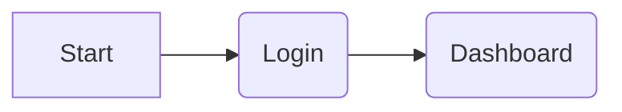
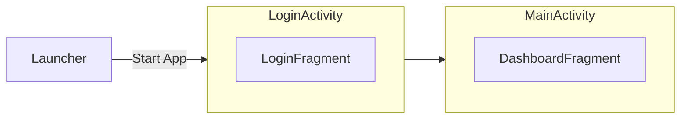
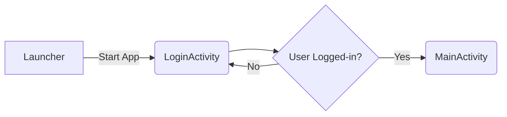
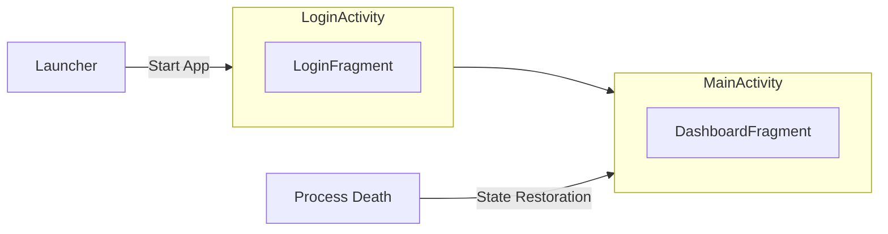

# Introduction

When you start a new job in an established company, you expect what is already in production to be working well, because it's in prod, right? Well, that's not always the case, unfortunately. 

This is the story on how that app already in production was not setup correctly from the ground up and the lessons learned along the way to fix it!

# The Wrong Setup

This app is a little particular because it's a kind of SaaS product, where there's a hard gateway of signup/login, and only after logging in successfully, the user can land on the main screen, a dashboard.

As there are always two steps, it was decided to implement this flow as two separate consecutive activities.

There's a **LoginActivity** to present the login flow to the user and when successful, this activity will `finish()` itself and start **MainActivity** which contains all the screens that expect the app to be in a logged-in state.

At some point, bugs from **production** started to pour in telling us that all the data of that Dashboard screen is empty! Clicking on anything there just crashed immediately the app! **How come?** 

The elephant in the room was obviously **[System-initiated Process Death](https://galex.dev/posts/process-death-is-the-rule-not-the-exception/)**. 

If **Process Death** is ignored, Android development is so much easier, but our app doesn't really work! That's why I openly envy my iOS colleagues where their application does indeed always (re)start from a starting point. They never have to deal with state restoration because It's just not a thing on iOS!

> ⚠️ If you wonder why this mechanism even exists, I invite you to read [Androids by Chet Hase](https://www.amazon.com/Androids-Built-Android-Operating-System/dp/1737354810) to get a glimpse into the situation in which those decisions were taken. It's always easy to complain but it's better to understand the context of taken decisions.

When **[System-initiated Process Death](https://galex.dev/posts/process-death-is-the-rule-not-the-exception/)** is correctly taken into account, the flow more like the following:

After the user has logged-in, used the dashboard for a while, then switched to another app, our app goes into the background and at some point Android decided to kill the process. When the user comes back to the app, Android will restore everything that was saved before killing the process. In this use case, only the **MainActivity** exists so that's Activity Entry Point that is restored!

# The Meh Patch

One potential fix to this is to check via the **LoginManager** that the user is actually logged-in and if not, redirect the user back to the **LoginActivity**.

That could work if there was only one screen/fragment in the **MainActivity**. There were multiple long flows in there that open from the Dashboard, so the user would completely lose those flows if we were to patch it this way. Meh.

# The Right Fix

On Android, **Every Screen Is An Entry Point**. As we know, Android restores the whole activities stack and it each activity, the fragments stack.

In this use case, Android will restore the **DashboardFragment** (inside **MainActivity**) and it should **ITSELF** navigate the user to the **LoginFragment** (inside **MainActivity** as well) on top of itself!

Always be conscious about [System-initiated Process Death](https://galex.dev/posts/process-death-is-the-rule-not-the-exception/)!
