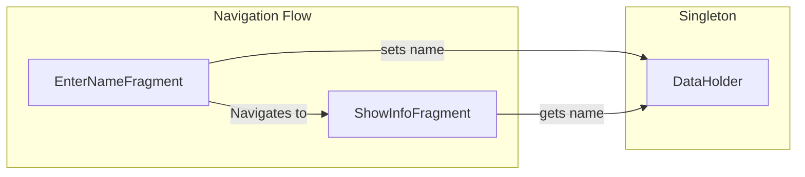

## Introduction

Once we [realize what System-initiated Process Death is](https://galex.dev/posts/process-death-is-the-rule-not-the-exception/) and how [an incorrect navigation setup](https://galex.dev/posts/every-screen-is-an-entry-point/) can completely screw up our app, it is very much time to talk about the different ways to detect those hidden issues!

## The Demo Setup

Let's say we have two screens and instead of passing a **name parameter** between them directly like it should be, we'll use a Singleton to hold that data.
Singletons are necessary in Android Development but are also a good example of a risky bet as they are kept in memory and memory being part of the process, **Singletons do not survive Process Death**.


In the `onViewCreated()` function of **EnterNameFragment** we'll get the name from the **EditText** when the **Next** button is pressed:
```kotlin
binding.next.setOnClickListener {
  // Setting the value entered in the editText into a Singleton
  val text = binding.enterName.text.toString()
  if (text.isNotBlank()) {
    DataHolder.name = text
  }
  // (...)
}
```
On the other end, the `onViewCreated()` function of **ShowInfoFragment** contains the following:
```kotlin
// Getting the name from our Singleton
binding.showName.text = getString(R.string.show_name, DataHolder.name ?: "null")
```
Here is this demo app running for the first time:



The name in **ShowInfoFragment** actually shows up even when a configuration change like orientation occurs!

Let's see now how this setup works when Process Death occurs:


## Conclusion

Android Developers do need to allocate time on their tasks to test and trigger System-initiated Process Death to be certain their screens actually work properly.


