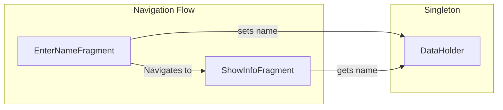

## Introduction

Once we [realize what System-initiated Process Death is](https://galex.dev/posts/process-death-is-the-rule-not-the-exception/) and how [an incorrect navigation setup](https://galex.dev/posts/every-screen-is-an-entry-point/) can completely screw up our app, it is very much time to talk about the different ways to detect those hidden issues!

## The Demo Setup

Let's say we have two screens and instead of passing a **name parameter** between them directly like it should be, we'll use a Singleton to hold that data.
Singletons are necessary in Android Development but are also a good example of a risky bet as they are kept in memory and memory being part of the process, **Singletons do not survive Process Death**.


In the `onViewCreated()` function of **EnterNameFragment** we'll get the name from the **EditText** when the **Next** button is pressed:
```kotlin
binding.next.setOnClickListener {
  // Setting the value entered in the editText into a Singleton
  val text = binding.enterName.text.toString()
  if (text.isNotBlank()) {
    DataHolder.name = text
  }
  // (...)
}
```
On the other end, the `onViewCreated()` function of **ShowInfoFragment** contains the following:
```kotlin
// Getting the name from our Singleton
binding.showName.text = getString(R.string.show_name, DataHolder.name ?: "null")
```
Let's run the app and see how it behaves in a "normal" flow:



The value filled in **EnterNameFragment** show up in **ShowInfoFragment** event after a configuration change like changing the orientation of the device.

## Reproducing the problem

What we want to do is to kill the app process, but **be careful to put the app in the background** first! 

If the app is in the Foreground, it is considered a user-driven process kill.

If the app is in the Background, killing the process triggers a **System-initiated Process Death** and that's exactly what we want to achieve here.

You can do it manually on your phone, or you can do it via adb (this emulates pressing on the home button):
```shell
adb shell input keyevent 3
```

### Locally using Android Studio

The option to trigger kill the process is available in `Logcat` by right-clicking anywhere and clicking on **Kill process**. 


### Locally using the Command Line

You'll need to have **adb** on the command line, and then run the following command
```shell
adb shell am kill <your package name>
```
In this project demo the package name is `dev.galex.process.death.demo` 
```shell
adb shell am kill dev.galex.process.death.demo
```

## Anywhere using Maestro

[Maestro](https://github.com/mobile-dev-inc/maestro) is a surprisingly easy tool to write end-to-end tests and is usually a tool you'd want your Continuous Integration server (GitHub Actions, Bitrise, etc.) to run periodically.

Our current flow can be tested like this:

```yaml
appId: dev.galex.process.death.demo
---
- launchApp
- tapOn:
    id: "dev.galex.process.death.demo:id/enter_name"
- inputText: "John Doe"
- tapOn:
    id: "dev.galex.process.death.demo:id/next"
- assertVisible:
    id: "dev.galex.process.death.demo:id/show_name"
    text: "Name = John Doe"
    enabled: true
- stopApp
```

## Conclusion

Android Developers do need to allocate time on their tasks to test and trigger System-initiated Process Death to be certain their screens actually work properly.


