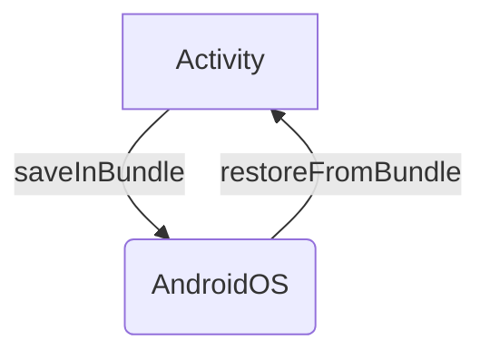

Let's review what are the tools the Android OS provides us developers to fix Process Death!

**State Management** is what we're looking for! We'll explore how Android expects to receive a **state** and how it gives that **state** back, so we can properly restore our screens. 

It's important to note that State Management isn't solely for dealing with Process Death.
It's als the mechanism we'll use to recover from **Configuration Changes** like switching the orientation of the device, or changing the [language of the app](https://developer.android.com/guide/topics/resources/app-languages).
When an Android App is properly managing its state, it will recover from anything that is thrown at it!

## The Four Entry Points to an Android App

There are **four Entry Points** to an Android App:
- Activities
- Services
- Broadcast Receivers
- Content Providers

When discussing the restoration of our screen's state, also known as UI State, our focus is primarily on Activities. 
Activities serve as our user interface from the Android OS perspective. The main mechanism for state management is built around them. Here's how it works:

- When our process is terminated, Android creates a new [Bundle](https://developer.android.com/reference/android/os/Bundle) for each Activity. This Bundle is passed to the Activity, allowing us to add values to it.
- When Android revives our app, it provides the previously saved Bundle to each Activity. This allows us to retrieve the values we previously stored in the Bundle.


That's the most important part to understand, as it forms the foundation for state preservation and restoration in all frameworks such as Views, Fragments, and Jetpack Compose.
This mechanism is also employed by any third-party libraries you might be using, like Jetpack Navigation.

## Managing State Preservation and Restoration

### Activities

Android provides one main method to help us save the state of an Activity:

- `onSaveInstanceState(Bundle outState)`: This method is called before the Activity is destroyed

And two main methods to help us restore their state:

- `onCreate(Bundle savedInstanceState)`: This method is called when the Activity is created
- `onRestoreInstanceState(Bundle savedInstanceState)`: This method is called after the Activity is recreated. It is called after `onStart()` and before `onResume()`

> ℹ️ The `onRestoreInstanceState` method is not called if the Activity is created for the first time. It is only called when the Activity is recreated after being destroyed.
> Using `onRestoreInstanceState()` is a matter of use cases. Usually, we'll use `onCreate()` to restore the state of the Activity.

Saving a State in an Activity is as simple as adding values to the `outState` Bundle:

```kotlin
    override fun onSaveInstanceState(outState: Bundle) {
        super.onSaveInstanceState(outState)
        outState.putString("name", name)
    }
```
And restoring it is as simple as retrieving the values from the `savedInstanceState` Bundle:

```kotlin
    override fun onCreate(savedInstanceState: Bundle?) {
        super.onCreate(savedInstanceState)
        if (savedInstanceState != null) {
            name = savedInstanceState.getString("name")
        }
    }
```

> ⚠️ Activities save all the View Hierarchy (for every View with a Resource ID) and all its Fragments states automatically.

If you are hungry for more, here's a deeper dive on [State Management in Activities](/posts/state-management-in-activities).

### Views

As Activities save the whole View Hierarchy for every view with a Resource ID, Views themselves need to provide their state.
To do so, Views can override the `onSaveInstanceState()` and `onRestoreInstanceState()` methods. 

The easiest way to save state in a View is using a Bundle, as it implements Parcelable:

```kotlin
    override fun onSaveInstanceState(): Parcelable? {
        return Bundle().apply {
            putParcelable("superState", super.onSaveInstanceState())
            putInt("count", count)
        }
    }
```
And restoring that state is also easy, using the bundle we put in `onSaveInstanceState`:

```kotlin
    override fun onRestoreInstanceState(state: Parcelable?) {
        if (state is Bundle) {
            count = state.getInt("count")
            super.onRestoreInstanceState(state.getParcelable("superState"))
        } else {
            super.onRestoreInstanceState(state)
        }
    }
```
### Fragments


### ViewModels

### Jetpack Compose


### Conclusion

Please check each deep dive in each subject as there is too much to for one post to cover!

- [State Management in Activities](/posts/state-management-in-activities)
- [State Management in Views](/posts/state-management-in-views)
- [State Management in Fragments](/posts/state-management-in-fragments)
- [State Management in ViewModels](/posts/state-management-in-viewmodels)
- [State Management in Jetpack Compose](/posts/state-management-in-jetpack-compose)

I hope you find this useful in your Android Development Journey! 🚀

Feel free to comment below if you have any questions or suggestions! 🙌

Cheers! 🍻

