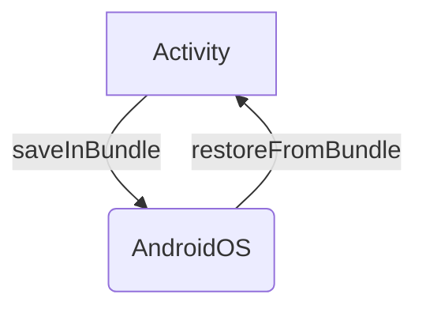

Process Death happens way more to our users than we think so let's review what are the tools the Android OS provides to counteract this extra complexity!

**State Management** is what we're looking for! We'll explore how Android expects to receive a **state** and how it gives that **state** back, so we can properly restore our screens. 

It's important to note that State Management isn't solely for dealing with Process Death.
It's als the mechanism we'll use to recover from **Configuration Changes** like switching the orientation of the device, or changing the [language of the app](https://developer.android.com/guide/topics/resources/app-languages).
When an Android App is properly managing its state, it will recover from anything that is thrown at it!

## The Four Entry Points to an Android App

There are **four Entry Points** to an Android App:
- Activities
- Services
- Broadcast Receivers
- Content Providers

When discussing the restoration of our screen's state, also known as UI State, our focus is primarily on Activities. 
Activities serve as our user interface from the Android OS perspective. The main mechanism for state management is built around them. Here's how it works:

- When our process is terminated, Android creates a new [Bundle](https://developer.android.com/reference/android/os/Bundle) for each Activity. This Bundle is passed to the Activity, allowing us to add values to it.
- When Android revives our app, it provides the previously saved Bundle to each Activity. This allows us to retrieve the values we previously stored in the Bundle.


That's the most important part to understand, as it forms the foundation for state preservation and restoration in all frameworks such as Views, Fragments, and Jetpack Compose.
This mechanism is also employed by any third-party libraries you might be using, like Jetpack Navigation.

To put it simply, the key understanding here is how these frameworks and libraries save and restore their state. So, the questions we need to ask ourselves are:
- How does this framework save its state and how does it restore it? 
- How does that library save its state and how does it restore it?

## Managing State Preservation and Restoration

### Activities

We'll create an Activity where the layout is created dynamically to raise a few interesting points.

```kotlin
class EnterNameActivity : AppCompatActivity() {

    private var name: String? = null
    private lateinit var editTextName: EditText

    override fun onCreate(savedInstanceState: Bundle?) {
        super.onCreate(savedInstanceState)

        // editText created dynamically
        editTextName = EditText(this).apply {
            hint = "Enter name"
            layoutParams = LinearLayout.LayoutParams(
                LinearLayout.LayoutParams.MATCH_PARENT,
                LinearLayout.LayoutParams.WRAP_CONTENT
            )
        }

        val layout = LinearLayout(this).apply {
            orientation = LinearLayout.VERTICAL
            addView(editTextName)
        }

        setContentView(layout)

        editTextName.addTextChangedListener { text ->
            name = text.toString()
        }
    }
}
```

Let's see how it behaves when the screen orientation changes:



When the configuration change or Process Death occurs, the entered value disappears! 

Let's fix this by saving and restoring the `name` variable.

Activities have one main method to help us **save** their state:

- `onSaveInstanceState(Bundle outState)`: This method is called before the Activity is destroyed. We can use it to save the state of the Activity.

And two main methods to help us restore their state:

- `onCreate(Bundle savedInstanceState)`: This method is called when the Activity is created. We can use it to restore the state of the Activity.
- `onRestoreInstanceState(Bundle savedInstanceState)`: This method is called after the Activity is recreated. It is called after `onStart()` and before `onResume()`.

> ℹ️ The `onRestoreInstanceState` method is not called if the Activity is created for the first time. It is only called when the Activity is recreated after being destroyed.
> Using `onRestoreInstanceState()` is a matter of use cases. Usually, we'll use `onCreate()` to restore the state of the Activity.

Let's modify the `EnterNameActivity` to save and restore the `name` variable:

```kotlin
class EnterNameActivity : AppCompatActivity() {

    private var name: String? = null
    private lateinit var editTextName: EditText

    override fun onCreate(savedInstanceState: Bundle?) {
        super.onCreate(savedInstanceState)

        // editText created dynamically
        editTextName = EditText(this).apply {
            hint = "Enter name"
            layoutParams = LinearLayout.LayoutParams(
                LinearLayout.LayoutParams.MATCH_PARENT,
                LinearLayout.LayoutParams.WRAP_CONTENT
            )
        }

        val layout = LinearLayout(this).apply {
            orientation = LinearLayout.VERTICAL
            addView(editTextName)
        }

        setContentView(layout)

        editTextName.addTextChangedListener { text ->
            name = text.toString()
        }

        // Restore the name value from savedInstanceState
        name = savedInstanceState?.getString("name")
        // Set the restored name value to the EditText
        name?.let { editTextName.setText(it) }
    }

    override fun onSaveInstanceState(outState: Bundle) {
        super.onSaveInstanceState(outState)
        outState.putString("name", name)
    }
}
```

Here we used the `onSaveInstanceState` method to save the `name` variable and the `onCreate` method to restore it. 
Let's see how it behaves now when the screen orientation changes, and also when Process Death occurs:



We're all good! We created manually a View and managed its state at the Activity level. 

But if we take a second to imagine having to do that for each View, I am pretty sure Android wouldn't have been adopted as much as it is today!

**As soon as a View has an ID**, Android will save its state and restore it **automatically**.

Let's declare an ID for the `EditText`:

```xml
<resources>
    <id name="name_edit_text" />
</resources>
```

And let's set it in the EditText:

```kotlin
class EnterNameActivity : AppCompatActivity() {

    private var name: String? = null
    private lateinit var editTextName: EditText

    override fun onCreate(savedInstanceState: Bundle?) {
        super.onCreate(savedInstanceState)

        // editText created dynamically
        editTextName = EditText(this).apply {
            hint = "Enter name"
            layoutParams = LinearLayout.LayoutParams(
                LinearLayout.LayoutParams.MATCH_PARENT,
                LinearLayout.LayoutParams.WRAP_CONTENT
            )
            // Setting the ID on the created View  
            id = R.id.name_edit_text
        }

        val layout = LinearLayout(this).apply {
            orientation = LinearLayout.VERTICAL
            addView(editTextName)
        }

        setContentView(layout)

        editTextName.addTextChangedListener { text ->
            name = text.toString()
        }
    }
}
```
We removed the manual saving and restoring of the `name` variable and added an ID that we created by declaring a resource id. Let's reproduce again Configuration Change and Process Death:



When a View has a proper id that will not change at runtime like a resource id, Android will save and restore its state automatically.
Android does this with the call to `saveHierarchyState()` on the `Window` object in the `onSaveInstanceState` method of the `android.app.Activity` class:
```kotlin
// Saving View Hierarchy In android.app.Activity class
protected fun onSaveInstanceState(@NonNull outState: Bundle) {
    outState.putBundle(WINDOW_HIERARCHY_TAG, mWindow.saveHierarchyState())
    // ...
}

// Restoring View Hierachy in android.app.Activity class
protected fun onRestoreInstanceState(@NonNull savedInstanceState: Bundle) {
    if (mWindow != null) {
        val windowState: Bundle = savedInstanceState.getBundle(WINDOW_HIERARCHY_TAG)
        if (windowState != null) {
            mWindow.restoreHierarchyState(windowState)
        }
    }
}
````
We can deduct that `saveHierarchyState()` works by building a Bundle that contains the state of all the Views in the Activity by building a tree of Bundles. Each Bundle represents the state of a View and is indexed by the View's ID.
When the Activity is recreated, `restoreHierarchyState()` is called with the Bundle that contains the state of all the Views. It will restore the state of each View by their IDs.

Now that we know this, let's see what how this happens on the other side of the mirror, inside [Views](#views).

### Views

### Fragments

### ViewModels

### Official documentation

### Conclusion
