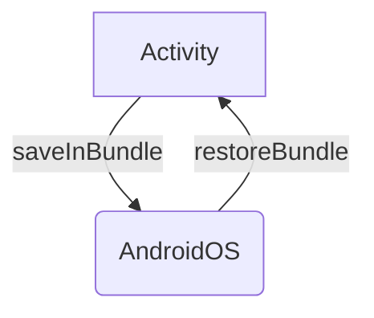

Process Death happens more than we think to our users so let's review what are all the tools the Android OS provides to counteract this extra complexity!

**State Restoration** is the term we're searching for! We'll be looking at how Android expects to receive a **state** and how it gives that **state** back so we developers can properly restore our screens. 

> ℹ️ This is the **5th** and last installment on Process Death! Here are the previous posts if you missed them:
> 1. [Process Death is the rule, not the exception!](https://galex.dev/posts/process-death-is-the-rule-not-the-exception/)
> 2. [Every Screen is an Entry Point](https://galex.dev/posts/every-screen-is-an-entry-point/)
> 3. [Detecting Process Death issues](https://galex.dev/posts/how-to-detect-process-death-issues/)
> 4. [Detecting Process Death Issues with Appium]()

## The Four Horsemen

There are and always will be **four Entry Points** to an Android App:
- **Activities**
- Services
- Broadcast Receivers
- Content Providers

We're talking about restoring the **state** of our screens (also called UI State) so we'll be looking at the relevant Entry Point which are **Activities**.
As Activities are our UI from the perspective of the Android OS, the **main mechanism** upon **State restoration** is built upon is that
- When our process gets killed, Android will create a new [Bundle](https://developer.android.com/reference/android/os/Bundle) for each Activity and pass that Bundle to that Activity, so we can **add** values into that Bundle
- When Android restores our app, it will pass the previously saved Bundle into each Activity, letting us **get** previously saved values from that Bundle



**That's all!** Knowing this, we can understand that each framework (Fragments, Compose, etc.) or any Library (Jetpack Navigation, etc) just connects to this mechanism one way or another to be able to save itself its own states.

> ℹ️ **State Restoration** doesn't exit only for recovering from Process Death.
> **State Restoration** is also the same mechanic to recover from **Configuration Changes** like changing the language of the app, or just changing the orientation.
> When an Android App is properly managing its state, it will recover from anything that is thrown at it!

## Giving and Receiving States


### Activities

The Android Documentation for Activities is very well documented, so I invite you to read its [part on the Activity Lifecycle](https://developer.android.com/guide/components/activities/activity-lifecycle#instance-state).

To saves values, we should override `onRestoreInstanceState()` as mentioned in the docs:
```kotlin
override fun onSaveInstanceState(outState: Bundle?) {
    // Save the user's current game state.
    outState?.run {
        putInt(STATE_SCORE, currentScore)
        putInt(STATE_LEVEL, currentLevel)
    }

    // Always call the superclass so it can save the view hierarchy state.
    super.onSaveInstanceState(outState)
}
```

To restore values from the **state**, we should override `onRestoreInstanceState()`:
```kotlin
override fun onRestoreInstanceState(savedInstanceState: Bundle?) {
    // Always call the superclass so it can restore the view hierarchy.
    super.onRestoreInstanceState(savedInstanceState)

    // Restore state members from saved instance.
    savedInstanceState?.run {
        currentScore = getInt(STATE_SCORE)
        currentLevel = getInt(STATE_LEVEL)
    }
}
```


### Views

### Fragments

### ViewModels

### Jetpack Compose


## Official documentation

The sujbect is vast as you can understand so here a few more resources
