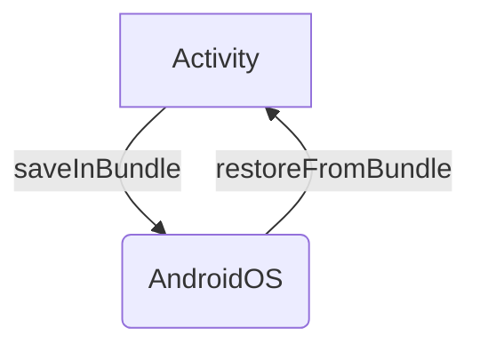

Process Death happens way more to our users than we think so let's review what are the tools the Android OS provides to counteract this extra complexity!

**State Restoration** is the term we're searching for! We'll be looking at how Android expects to receive a **state** and how it gives that **state** back so we developers can properly restore our screens. 

By the way, **State Restoration** doesn't exit only for recovering from Process Death.
**State Restoration** is also the same mechanism to recover from **Configuration Changes** like changing the language of the app, or just changing the orientation.
When an Android App is properly managing its state, it will recover from anything that is thrown at it!


> ℹ️ This is the **5th** and last installment on Process Death! Here are the previous posts if you missed them:
> 1. [Process Death is the rule, not the exception!](https://galex.dev/posts/process-death-is-the-rule-not-the-exception/)
> 2. [Every Screen is an Entry Point](https://galex.dev/posts/every-screen-is-an-entry-point/)
> 3. [Detecting Process Death issues](https://galex.dev/posts/how-to-detect-process-death-issues/)
> 4. [Detecting Process Death Issues with Appium]()

## The Four Entry Points to an Android App

There are and always will be **four Entry Points** to an Android App:
- **Activities**
- Services
- Broadcast Receivers
- Content Providers

We're talking about restoring the **state** of our screens (also called UI State) so we'll be looking at the relevant Entry Point which are **Activities**.
As Activities are our UI from the perspective of the Android OS, the **main mechanism** upon **State restoration** is built upon is that
- When our process gets killed, Android will create a new [Bundle](https://developer.android.com/reference/android/os/Bundle) for each Activity and pass that Bundle to that Activity, so we can **add** values into that Bundle
- When Android restores our app, it will pass the previously saved Bundle into each Activity, letting us **get** previously saved values from that Bundle



An important point is that **Activities** are the only Entry Points that can be restored. The other three Entry Points do not have (and do not need) such mechanism.

Knowing this is the basis on which **State Restoration** is built, we can now look at how to save and restore the state of our Activities, Views, Fragments, and ViewModels.
We'll now look at Views, Fragments and Jetpack Compose to see how they connect to this mechanism.

## Managing State Preservation and Restoration


### Activities

In Android, activities have their own lifecycle and state. They can save and restore their state using the `onSaveInstanceState()` and `onCreate()`/ `onRestoreInstanceState()` methods:

```kotlin
class MainActivity : AppCompatActivity() {
    private lateinit var currentName: String? = null
  
    override fun onCreate(savedInstanceState: Bundle?) {
        super.onCreate(savedInstanceState)
        setContentView(R.layout.activity_main)

        // Restore state members from saved instance
        if (savedInstanceState != null) {
            currentScore = savedInstanceState.getInt(STATE_SCORE)
            currentLevel = savedInstanceState.getInt(STATE_LEVEL)
        }
    }

    override fun onSaveInstanceState(outState: Bundle) {
        // Save the user's current game state
        outState.run {
            putInt(STATE_SCORE, currentScore)
            putInt(STATE_LEVEL, currentLevel)
        }

        // Always call the superclass so it can save the view hierarchy state
        super.onSaveInstanceState(outState)
    }

    override fun onRestoreInstanceState(savedInstanceState: Bundle) {
        // Always call the superclass so it can restore the view hierarchy
        super.onRestoreInstanceState(savedInstanceState)

        // Restore state members from saved instance
        savedInstanceState.run {
            currentScore = getInt(STATE_NAME)
            currentLevel = getInt(STATE_LEVEL)
        }
    }

    companion object {
      private const val STATE_NAME = "nameState"
    }  
}

```
In this code, we're saving the `myState` string in `onSaveInstanceState()`. Then, we're restoring these values in `onCreate()` and `onRestoreInstanceState()`. The `onCreate()` method is called when the activity is first created`, and `onRestoreInstanceState()` is called when the activity is being re-initialized from a previously saved state.


### Views

In Android, views also have their own lifecycle and state. They can save and restore their state using the `onSaveInstanceState()` and `onRestoreInstanceState()` methods. Here's an example of how you can do it:

```kotlin
class CustomView(context: Context, attrs: AttributeSet) : View(context, attrs) {
    private var customState: String? = null

    override fun onSaveInstanceState(): Parcelable {
        val superState = super.onSaveInstanceState()
        val savedState = SavedState(superState)
        savedState.customState = this.customState
        return savedState
    }

    override fun onRestoreInstanceState(state: Parcelable) {
        if (state is SavedState) {
            super.onRestoreInstanceState(state.superState)
            this.customState = state.customState
        } else {
            super.onRestoreInstanceState(state)
        }
    }

    private class SavedState : BaseSavedState {
        var customState: String? = null

        constructor(superState: Parcelable) : super(superState)

        constructor(source: Parcel) : super(source) {
            customState = source.readString()
        }

        override fun writeToParcel(out: Parcel, flags: Int) {
            super.writeToParcel(out, flags)
            out.writeString(customState)
        }

        companion object {
            @JvmField
            val CREATOR: Parcelable.Creator<SavedState> = object : Parcelable.Creator<SavedState> {
                override fun createFromParcel(source: Parcel): SavedState = SavedState(source)
                override fun newArray(size: Int): Array<SavedState?> = arrayOfNulls(size)
            }
        }
    }
}
```

### Fragments

Fragments, like activities, can save their state in a Bundle during `onSaveInstanceState()`. This state can then be restored in `onCreate()`, `onCreateView()`, or `onActivityCreated()`.

```kotlin
class MyFragment : Fragment() {
    private var myState: String? = null

    override fun onSaveInstanceState(outState: Bundle) {
        super.onSaveInstanceState(outState)
        outState.putString("myState", myState)
    }

    override fun onViewStateRestored(savedInstanceState: Bundle?) {
        super.onViewStateRestored(savedInstanceState)
        myState = savedInstanceState?.getString("myState")
    }
}
```

### ViewModels

ViewModels are a part of the Android Architecture Components and are designed to store and manage UI-related data in a lifecycle conscious way. They survive configuration changes. However, they do not survive process death. For that, you need to combine them with `onSaveInstanceState()`.

```kotlin
class MyViewModel : ViewModel() {
    private var myState: String? = null

    fun saveState(outState: Bundle) {
        outState.putString("myState", myState)
    }

    fun restoreState(savedInstanceState: Bundle?) {
        myState = savedInstanceState?.getString("myState")
    }
}
```

### Jetpack Compose

In Jetpack Compose, you can use the `rememberSaveable` function to automatically save and restore the state across process death.

```kotlin
@Composable
fun MyComposable() {
    var myState by rememberSaveable { mutableStateOf("initial value") }
}
```

## Official documentation

The official Android documentation provides a comprehensive guide on how to save and restore the state of an app. Here are some useful links:

- [Saving and restoring activity state](https://developer.android.com/topic/libraries/architecture/saving-states)
- [Saving UI States](https://developer.android.com/topic/libraries/architecture/viewmodel-savedstate)
- [Handling Lifecycles with Lifecycle-Aware Components](https://developer.android.com/topic/libraries/architecture/lifecycle)
- [Jetpack Compose state and Jetpack libraries](https://developer.android.com/jetpack/compose/state#state-and-jetpack-libraries)

Other useful resources include:
- [The Top 3 State Management Mistakes On Android](https://www.youtube.com/watch?v=JfCivo5qJkI) by [Philipp Knacker](https://twitter.com/plcoding)


Conclusion

> ℹ️ **State Restoration** doesn't exit only for recovering from Process Death.
> **State Restoration** is also the same mechanic to recover from **Configuration Changes** like changing the language of the app, or just changing the orientation.
> When an Android App is properly managing its state, it will recover from anything that is thrown at it!
