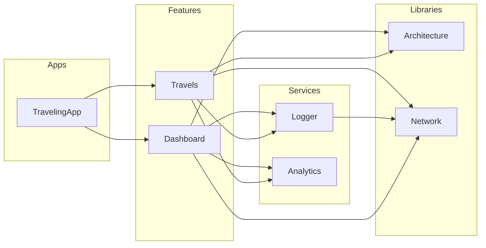

Once a project reaches a certain size, the need to modularize becomes crucial to keep the codebase maintainable and scalable.

Let's


> ℹ️ 

Turns out, there are **many** ways to modularize our code, and it's not always clear which one is the best for our project.

# Use Case

Talking without an example is not very helpful, so let's look at a use case of a Travelling App.

The requirements are:

- Display a dashboard of the current travel to the user (Dashboard Feature Module)
- Present a button to a screen list of travels (Travels Feature Module)
- Create a Logger to send logs to the server (Logger Service Module)
- Create an Analytics service to track user interactions (Analytics Service Module)

In between the lines, we can understand that:

- The App will depend on the `Dashboard` and `Travels` features
- The `Dashboard` and `Travels` features need to log and send analytics as well
- To send logs over the network, the `Logger` service will need to do some networking 
- To send analytics events over the network, the `Analytics` service will depend on the `Network` library

# Terminology

Before we start, let's define some types of modules to have a common language, applied to our use case:

- Libraries: Set of classes or tools that any other module might need to depend on, like Network or Architecture
- Services: Modules responsible for a specific task, like Logger or Analytics
- Features: Modules that represent a specific feature of the app, like Dashboard or Travels
- Apps: The final product, the traveling app that the user will use


We can represent those hierarchy like this: 




To start with, we'll take an concrete example of a few requirements:

- a `Feature` of a `Dashboard` to present basic information to the user
- a `Service` to fetch the data from the network


As an exercise, we'll create a Feature, a Seri


# Type I - One Module

> ℹ️ One Module only 

When a new project is started, one only module `app` is generated .


# Type II

> ℹ️ Multiple Modules, API / IMPLs

# Type III

> ℹ️ Multiple Modules, API /' DI

If somxe naming conventions doesn't fit your project, you can configure the plugin in your `build.gradle.kts`:

```kotlin
yamvil {
    level = YamvilLevel.Error // or Warning
    compose {
        screenSuffix = "MVIScreen" // Default value is "Screen"
        uiStateParameterName = "state" // Default value is "uiState"
        handleEventParameterMame = "onEvent" // Default value is "handleEvent"
    }
}
```

## Conclusion


By the way, I'm also on [Twitter](https://twitter.com/galex) and [LinkedIn](https://www.linkedin.com/in/agherschon/), so feel free to connect there too!

Happy coding! 📖
