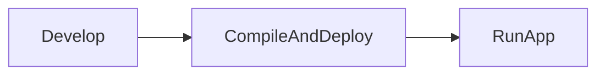
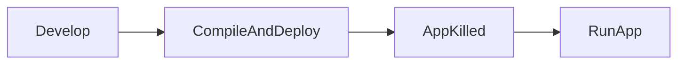
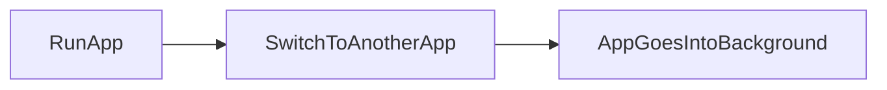
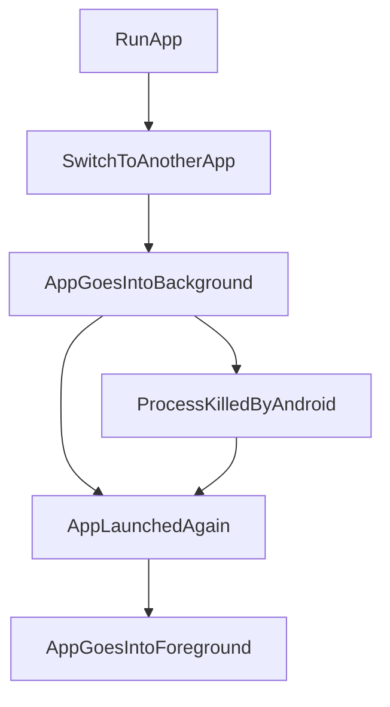

Once, I worked on an Android App where, from the start, **Process Death** was simply ignored. **Crazy, right?**

But how come it is actually possible to **entirely miss this point** on Android, although there are [lots](https://developer.android.com/topic/libraries/architecture/viewmodel/viewmodel-savedstate) of [hints](https://developer.android.com/topic/libraries/architecture/saving-states) everywhere in the Android APIs that it is indeed necessary?

## Devs don't experience System-initiated Process Death

When we develop an app, we develop some code then we press the little green button to deploy the app on the device:

What actually happens is super important:

The process in which the app runs is completely killed because the app file (apk) is completely replaced on the disk of the device. If the app was already running, Android can only completely kill its process **without** keeping the app state.

That means we developers run the app from our IDE Android Studio as if the device was **just turned on and the app was launched for the first time!**

> ⚠️ The same happens when users are doing any action that kills the app like throwing it up from the Recent Apps, or going into the App Settings and force-stopping it, usually called **User-driven Process Death**.

## Users experience System-initiated Process Death a LOT

What happens to the app on the users device is a totally different story!

Users run our app and at some point they probably switch to another app or lock their devices and that puts our app **into the background** so the flow is more like the following:


That's when we can encounter the potential source of lurking issues, the **System-initiated Process Death**.

Android, our loved OS, reserves itself the right to **Kill The Process at any point** in the background, and it will be completely transparent to the user:



How is this different from what developers do? 

In case of **System-initiated Process Death**, the Android OS will keep the **state** of the application (as a Bundle) till the app will come back into the foreground, which is the mechanism commonly referred to as **state restoration**.

Does it happen a lot? Not on our up-to-date latest Google Pixel or Samsung phone, that's for sure!

We can blindly think **System-initiated Process Death** doesn't happen at all or enough to care, but for lots of users, this happens a LOT!

## How to find out System-initiated Process Death issues?

To find out if your app suffers from poor **state restoration** management, depending on how extreme you are allowed to be at your company, I suggest triggering a fatal (or non-fatal) crash, or at least a log event for each parameter in each screen which it depends on, directly or indirectly:
```kotlin
override fun onCreate(savedInstanceState: Bundle?) {
  super.onCreate(savedInstanceState)
  // Test for arguments you sent to the fragment that are mandatory
  if (arguments?.containsKey("id")?.not() == true) throw IllegalStateException("id parameter in screen $screenName not found but is mandatory")
  // Test for values you added in the savedInstanceState that are mandatory
  if (savedInstanceState != null && savedInstanceState.containsKey("selectedBottomBarItem").not()) throw IllegalStateException("selectedBottomBarItem parameter in screen $screenName not found")
  // Test for important parameters you manage in other places that this screen depends on
  if (authManager.token == null) throw IllegalStateException("AuthManager should have gotten a valid token before accessing screen $screenName")
}
```
This way you will be notified if something goes wrong in your app.

##### Postscriptum

Thanks a lot to [Catalin Ghita](https://www.linkedin.com/feed/update/urn:li:activity:7179343647681724416?commentUrn=urn%3Ali%3Acomment%3A%28activity%3A7179343647681724416%2C7179936535994109954%29&dashCommentUrn=urn%3Ali%3Afsd_comment%3A%287179936535994109954%2Curn%3Ali%3Aactivity%3A7179343647681724416%29) for pointing out the right terminology for the two existing types of process death on Android. I've made sure to add those in the post! 👍
