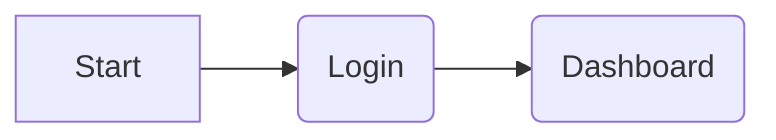
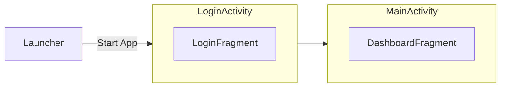
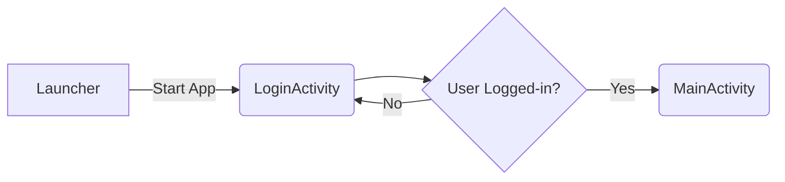
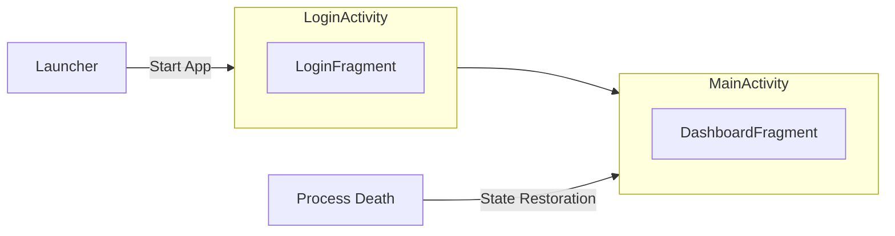
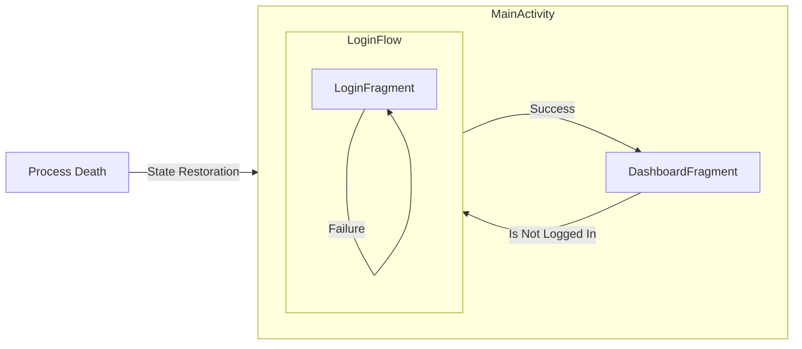
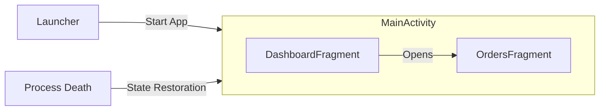
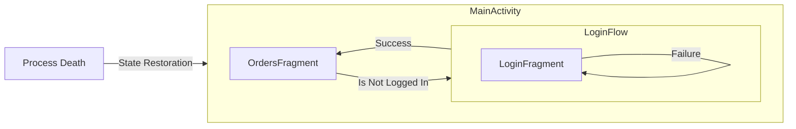

When we start a new job in an established company, we expect what is already in production to be working well, because it's in prod, right? Well, that's not always the case, unfortunately. 

This is the story on how that app already in production was not setup correctly from the ground up and the lessons learned along the way to fix it!

## The Wrong Setup

The special thing about that app is that it has a **hard gateway** meaning there's a signup/login flow, and only after logging in successfully, the user can land on the main screen, a dashboard.

As there are always two steps, it was decided back then to implement this flow as two separate consecutive activities.

There's a **LoginActivity** to present the login flow to the user and when successful, this activity will `finish()` itself and start **MainActivity** which contains all the screens that expect the app to be in a logged-in state. The navigation logic looked something like this:

It sounds OK, right? Except it wasn't.

Issues reported from **production** started to pour in telling us that all the data of that Dashboard screen was sometimes missing! Clicking on anything there just crashed immediately the app! **How come?** 

After a long and deep investigation, we found out the root cause of the issue was the **[System-initiated Process Death](/posts/process-death-is-the-rule-not-the-exception/)** mechanism. If **Process Death** is ignored, Android development is so much easier, but our app doesn't really work! 

When **[System-initiated Process Death](/posts/process-death-is-the-rule-not-the-exception/)** is correctly taken into account, the flow looks like the following:

After the user has logged-in, used the dashboard for a while, then switched to another app, our app goes into the background and at some point Android decided to kill the process. When the user comes back to the app, Android will restore everything that was saved before killing the process. 

In this case, only **MainActivity** exists on the activity stack (remember, **LoginActivity** was `finish()`'d) which **means we never go again through the Login flow!**

## The Meh Patch

One potential fix is to check if the user is logged-in in each screen but redirect the user back to the **LoginActivity**.

That could work if there was only one screen/fragment in the **MainActivity**, but as soon as there are multiple flows that open from the Dashboard, the user would completely lose those flows if we were to patch it this way. 

Deeplinks would also be broken if we would implement it this way.

Meh.

## The Right Fix

On Android, **Every Screen Is An Entry Point**.

Android will restore the **DashboardFragment** within **MainActivity** and that fragment should **ITSELF** immediately navigate to **LoginFragment** if needed!

> ℹ️ As this app uses Jetpack Navigation with Fragments, **LoginActivity** was merged into **MainActivity** so that any screen can `navController.navigate()` to a new [nested graph](https://developer.android.com/guide/navigation/design/nested-graphs) called **login_graph**.

Let's add an **OrdersFragment** that opens up from **DashboardFragment** when a button is clicked:

**Each screen** has to be able to trigger the login flow itself, so this is what needs to happen if **OrdersFragment** is the one on top of the fragment stack and **Process Death** occurs:

> ℹ️ **DashboardFragment** awaits patiently on the back stack or wherever your navigation library decides put it in the meantime.

## Conclusion

We **have to think of every screen as being completely independent** of the app (and of any flow) so that it can always survive anything that is thrown at it.

> ⚠️ I deliberately didn't write any technical solution about some specific library because this has nothing to do with any navigation library, but it is primordial you understand **what are the tools** your navigation library gives you to solve the issue and even then it's possible to miss the point, but that's material for a whole other post. 

Stay safe out there and be conscious about [System-initiated Process Death](/posts/process-death-is-the-rule-not-the-exception/)!
