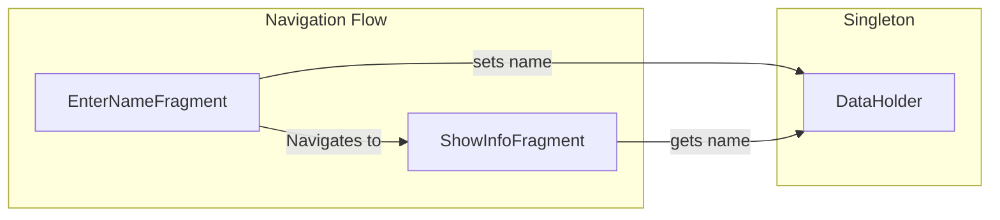
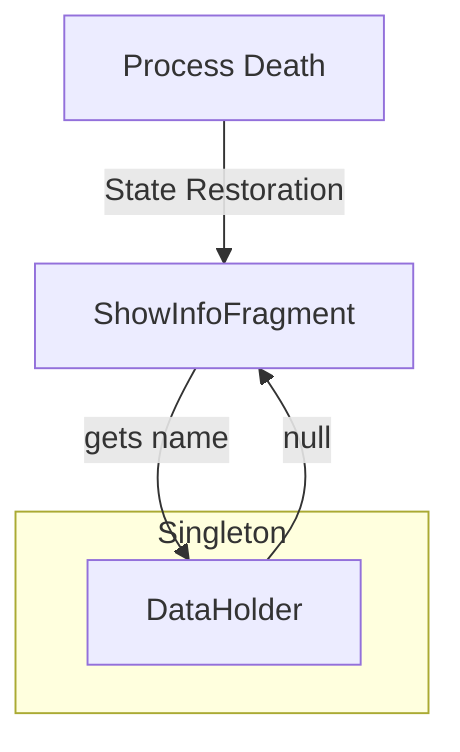

Once we [realized what System-initiated Process Death is](https://galex.dev/posts/process-death-is-the-rule-not-the-exception/) and learned how [an incorrect navigation setup](https://galex.dev/posts/every-screen-is-an-entry-point/) can completely screw up our app, it is very much time to talk about the different ways to detect those hidden issues!

## The Demo Setup

We will use a [demo project](https://github.com/galex/process-death-demo-project) containing a fragment-based app built with two screens:
- A first screen to enter a name called **EnterNameFragment** 
- Second one to show that information called **ShowInfoFragment**

And to create a problematic situation we will not pass the value of the entered **name** between them directly through navigation like it should be done, but instead we'll use a **Singleton** called **DataHolder** to hold that data in memory.

```kotlin
object DataHolder {
    var name: String? = null
}
```

> ⚠️ Singletons are a good tool in Android Development but are also a good example of a risky bet for data management as they are kept in memory and memory being part of the process, their data can just disappear without a trace! 
> 
> In other words, **Singletons do not survive Process Death**.

This whole logic looks like this:


In the `onViewCreated()` function of **EnterNameFragment** we'll get the name from the **EditText** when the **Next** button is pressed:
```kotlin
binding.next.setOnClickListener {
  // Setting the value entered in the editText into a Singleton
  val text = binding.enterName.text.toString()
  if (text.isNotBlank()) {
    DataHolder.name = text
  }
  // (...)
}
```
On the other end, the `onViewCreated()` function of **ShowInfoFragment** contains the following:
```kotlin
// Getting the name from our Singleton
binding.showName.text = getString(R.string.show_name, DataHolder.name ?: "null")
```
Let's run the app and see how it behaves in a "normal" flow:



Here are the detailed steps of what is going on in this video:

- Launching the app
- Filling up my name in the EditText of the first screen, **EnterNameFragment**
- Tapping on the Next button
- Seeing `Name = Alex Gherschon` on the second screen, **ShowInfoFragment**
- Rotating the device to landscape and back to portrait
- Coming back and forth between the two screens again
- Still seeing `Name = Alex Gherschon` on the second screen, **ShowInfoFragment**

## Triggering System-initiated Process Death

Before killing the process of the app, **we need to put the app in the background FIRST!** 

- When the app is in the **foreground**, and we kill the process, it reproduces a user-driven process death and at the next launch the app will restart from scratch which is not the expected result
- When the app is in the **background**, and we kill the process, only then a **System-initiated Process Death** happens and that's exactly **what we want!**

We can do it manually on our phone by going back to Home or switching to another app, or we can do it via ADB by emulating pressing the Home button, for example:

```shell
adb shell input keyevent 3
```

### Using Android Studio

The option to trigger killing the process is available in `Logcat` by right-clicking to show the context menu and clicking on **Kill process**. 


### Using ADB on the Command Line

On the command line, run the following command:
```shell
adb shell am kill <package name>
```
In this demo project the package name is `dev.galex.process.death.demo` so we'll be running the following: 
```shell
adb shell am kill dev.galex.process.death.demo
```

### Using the Developer Options

On our Android Device, in the Settings screen under **Developer options** we can define the number of background processes Android will keep at any point.

{: width="40%" style="display:block; margin-left: auto; margin-right: auto;" }

We'll set it to **No Background processes** and then switch from our app to one or two others apps then come back to ours. Then, if we see the Splash screen of our app showing up and the app opening on the screen we left on, we've managed to trigger it properly.

## The End Result

### The Faulty Flow

Now that we learned about [3 ways of triggering killing the process](#triggering-system-initiated-process-death) of our app, we'll run a normal flow, put the app into the background, kill the process, open our app from the Recent Apps and see what happens!



Here are the steps of what we can see in this video:

- Launching the app
- Filling up my name in the EditText of the first screen, **EnterNameFragment**
- Tapping on the Next button
- Seeing `Name = Alex Gherschon` on the second screen, **ShowInfoFragment**
- Putting the app in the background
- [Triggering Process Death through Android Studio](#using-android-studio)
- Opening the app from the Recent Apps 
- App re-opens on the second screen, **ShowInfoFragment**
- Seeing `Name = null` on the second screen, **ShowInfoFragment**

**This is the exact behavior we were looking for!**

As the process is killed, our **DataHolder** Singleton dies as well and as we know that [Every Screen is an Entry Point](https://galex.dev/posts/every-screen-is-an-entry-point/), Android restores **ShowInfoFragment** directly which gets the **name** value from a freshly created Singleton that is actually empty, which is why we now see `Name = null` when our app re-opens.



### The Right Solution

To solve the specific problem here, the **name** value sent from **EnterNameFragment** into **ShowInfoFragment** should be done via the [arguments](https://developer.android.com/reference/androidx/fragment/app/Fragment.html#Fragment()) mechanism of Fragments as those are properly saved and restored through the whole app lifecycle which is what any navigation library normally uses under the hood.

## Conclusion

We've created, detected and fixed a real issue that is hiding in plain sight and is quite hard to come across when our mindset is in development mode.

Because this is the reality of Android Development, **I strongly suggest** to always test **each screen** in **each flow** of our apps.

Following to this, I plan on writing soon about:

- How to automate testing for [System-initiated Process Death](https://galex.dev/posts/process-death-is-the-rule-not-the-exception/)
- All the State Restoration tools provided by Android OS

Stay tuned!


