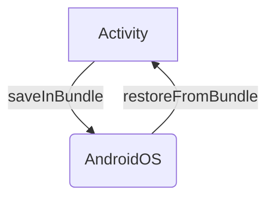

We'll now explore how Android expects to receive a **state** and how it gives that **state** back, so we can properly restore our screens. 
This whole mechanism is called **State Management** or **State Preservation and Restoration**.

It's important to note that **State Management** isn't there to deal only with [System-initiated Process Death](/posts/process-death-is-the-rule-not-the-exception).
It's also the same mechanism we'll use to recover from **Configuration Changes** like switching the orientation of the device, or changing [the app language](https://developer.android.com/guide/topics/resources/app-languages).

When an Android App is properly managing its state, it will recover from anything that is thrown at it!

> ⚠️ We should save via **State Management** any data that is necessary to restore the screen to its previous state that **is not already saved in Shared Preferences, a Database, or a remote Server**.

## The Four Entry Points to an Android App

There are **four Entry Points** to an Android App:
- Activities
- Services
- Broadcast Receivers
- Content Providers

When discussing the restoration of our screen's state, also known as UI State, our focus is primarily on Activities. 
Activities serve as our user interface from the Android OS perspective. The main mechanism for state management is built around them. Here's how it works:

- When our process is terminated, Android creates a new [Bundle](https://developer.android.com/reference/android/os/Bundle) for each Activity. This Bundle is passed to the Activity, allowing us to add values to it
- When Android revives our app, it provides the previously saved Bundle to each Activity. This allows us to retrieve the values we previously stored in the Bundle



That's the most **important part to understand**, as it forms the foundation for state preservation and restoration in all Android frameworks such as Views, Fragments, ViewModels, and Jetpack Compose.
This mechanism is also employed by any third-party libraries we might be using, like [Jetpack Navigation](https://developer.android.com/guide/navigation).

> ℹ️ The three other Entry Points have no built-in mechanism for state preservation and restoration.

## Managing State Preservation and Restoration

### Activities

Android provides one main method to help us save the state of an Activity:

- `onSaveInstanceState(Bundle outState)`: This method is called before the Activity is destroyed

And two main methods to help us restore their state:

- `onCreate(Bundle savedInstanceState)`: This method is called when the Activity is created
- `onRestoreInstanceState(Bundle savedInstanceState)`: This method is called after the Activity is recreated. It is called after `onStart()` and before `onResume()`

> ℹ️ The `onRestoreInstanceState` method is not called if the Activity is created for the first time. It is only called when the Activity is recreated after being destroyed.
> Using `onRestoreInstanceState()` is a matter of use cases. Usually, we'll use `onCreate()` to restore the state of the Activity.

Saving a State in an Activity is as simple as adding values to the `outState` Bundle:

```kotlin
override fun onSaveInstanceState(outState: Bundle) {
    super.onSaveInstanceState(outState)
    outState.putString("name", name)
}
```
And restoring it is as simple as retrieving the values from the `savedInstanceState` Bundle:

```kotlin
override fun onCreate(savedInstanceState: Bundle?) {
    super.onCreate(savedInstanceState)
    if (savedInstanceState != null) {
        name = savedInstanceState.getString("name")
    }
}
```

Activities saves the **View Hierarchy**, for every View with a Resource ID, and all its **Fragments states** automatically. 
Here's the code from `android.app.Activity` that does it for us:

```java
protected void onSaveInstanceState(@NonNull Bundle outState) {
    // Here is saved the View Hierarchy
    outState.putBundle(WINDOW_HIERARCHY_TAG, mWindow.saveHierarchyState());
    // Here are saved all the fragments states
    Parcelable p = mFragments.saveAllState();
    if (p != null) {
        outState.putParcelable(FRAGMENTS_TAG, p);
    }
    // more stuff here
}
```


For more in-depth knowledge, consider reading the detailed article on [State Management in Activities](/posts/state-management-in-activities).


### Views

As Activities save the whole View Hierarchy for every view with a Resource ID, Views themselves need to provide their state.
To do so, Views can override the `onSaveInstanceState()` and `onRestoreInstanceState()` methods. 

The easiest way to save state in a View is using a Bundle, as it implements Parcelable:

```kotlin
override fun onSaveInstanceState(): Parcelable? {
    return Bundle().apply {
        putParcelable("superState", super.onSaveInstanceState())
        putInt("count", count)
    }
}
```
And to restore that state we'll use the bundle we put in `onSaveInstanceState`:

```kotlin
override fun onRestoreInstanceState(state: Parcelable?) {
    if (state is Bundle) {
        count = state.getInt("count")
        super.onRestoreInstanceState(state.getParcelable("superState"))
    } else {
        super.onRestoreInstanceState(state)
    }
}
```

Check out a deeper dive on [State Management in Views](/posts/state-management-in-views) for more details.


### Fragments

When we want to create a Fragment, we should use the `newInstance()` pattern because Fragments need to have a no-argument constructor, so we can't pass any argument to them directly. 

The `newInstance()` pattern looks like this:

```kotlin
class ShowInfoFragment : Fragment() {

    // (...)

    companion object {
        fun newInstance(name: String): ShowInfoFragment {
            return ShowInfoFragment().apply {
                arguments = Bundle().apply {
                    putString("name", name)
                }
            }
        }
    }
}
```
Arguments are automatically saved and restored by `androidx.fragment.app.FragmentStateManager` in its `saveState()` function, so we don't need to worry about saving those ourselves:

```java
if (mFragment.mArguments != null) {
    stateBundle.putBundle(ARGUMENTS_KEY, mFragment.mArguments);
}
```
If there is some extra data to save, Fragments also have a built-in mechanism for saving and restoring their state.

The `onSaveInstanceState(Bundle outState)` method is called before the Fragment is destroyed:

```kotlin
override fun onSaveInstanceState(outState: Bundle) {
    super.onSaveInstanceState(outState)
    outState.putString("name", name)
}
```

And as with Activities, we have two functions with similar purpose to restore the state:

- `onCreateView(inflater: LayoutInflater, container: ViewGroup?, savedInstanceState: Bundle?)`
- `onViewCreated(view: View, savedInstanceState: Bundle?)`

Using those looks like this:

```kotlin
override fun onCreateView(inflater: LayoutInflater, container: ViewGroup?, savedInstanceState: Bundle?): View? {
    if (savedInstanceState != null) {
        name = savedInstanceState.getString("name")
    }
    return inflater.inflate(R.layout.fragment_name, container, false)
}
```

And for `onViewCreated`:

```kotlin
override fun onViewCreated(view: View, savedInstanceState: Bundle?) {
    super.onViewCreated(view, savedInstanceState)
    if (savedInstanceState != null) {
        name = savedInstanceState.getString("name")
    }
}
```
Usually, we'll use `onViewCreated()` to restore the state of the Fragment.

> ⚠️ We should **never** pass arguments or callbacks to a Fragment constructor!
> - For arguments, we should use the `newInstance()` pattern
> - For callbacks, we should use the [Fragment Result API](https://developer.android.com/guide/fragments/communicate#fragment-result)
> 
> And if we're using [Jetpack Navigation](https://developer.android.com/guide/navigation)
> 
> - For arguments, we should use the [Safe Args](https://developer.android.com/guide/navigation/use-graph/pass-data#Safe-args) library
> - For callbacks, we should use the [savedStateHandle of the previous destination](https://developer.android.com/guide/navigation/use-graph/programmatic#returning_a_result)



For a deeper dive on [State Management in Fragments](/posts/state-management-in-fragments), check out the post!


### ViewModels

ViewModels are a bit different from the previous examples. They have a built-in mechanism for saving and restoring their state but not by using functions. 

ViewModels can receive an object of type `SavedStateHandle` that can be used to save and restore state:

```kotlin
class NameViewModel(private val savedStateHandle: SavedStateHandle) : ViewModel() {
    private val _name = MutableStateFlow<String?>(savedStateHandle.get<String>("name"))
    val name: StateFlow<String?> = _name.asStateFlow()

    fun setName(name: String) {
        savedStateHandle.set("name", name)
    }
}
```

### Jetpack Compose

We could be tempted to use `remember()` for our [MutableState](https://developer.android.com/reference/kotlin/androidx/compose/runtime/MutableState) typed `name` variable:

```kotlin
@Composable 
fun NameScreen() {
    var name by remember { mutableStateOf("Name") }
    TextField(value = name, onValueChange = { name = it })
}
```

But `remember()` doesn't save the state of the `name` variable when the process is terminated!

Instead, we need to use `rememberSaveable()`:

```kotlin
@Composable 
fun NameScreen() {
    var name by rememberSaveable { mutableStateOf("Name") }
    TextField(value = name, onValueChange = { name = it })
}
```

> ℹ️ `rememberSaveable()` is the Compose equivalent of putting an ID on a View!

### Conclusion

We have learned about **State Management** in Android via the available APIs and mechanisms in Activities, Views, Fragments, ViewModels, Jetpack Compose, and even Jetpack Navigation. 
There's so much more to learn about State Management in Android! Coming up, deep dives on:

- State Management in Activities
- State Management in Views
- State Management in Fragments
- State Management in ViewModels
- State Management in Jetpack Navigation
- State Management in Jetpack Compose


- [State Management in Activities](/posts/state-management-in-activities)
- [State Management in Views](/posts/state-management-in-views)
- [State Management in Fragments](/posts/state-management-in-fragments)
- [State Management in ViewModels](/posts/state-management-in-viewmodels)
- [State Management in Jetpack Compose](/posts/state-management-in-jetpack-navigation)
- [State Management in Jetpack Compose](/posts/state-management-in-jetpack-compose)


Feel free to comment below if you have any questions!

By the way, I'm also on [Twitter](https://twitter.com/galex) and [LinkedIn](https://www.linkedin.com/in/agherschon/), so feel free to connect there too!

Stay tuned for more posts on Android Development! 🚀
