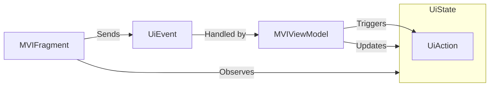

I'm very excited to introduce [Yamvil](https://github.com/galex/yamvil), a new Library and Compiler Plugin for Android and Compose Multiplatform! 🚀

# MVI Architecture

MVI stands for Model-View-Intent, and it's a pattern that helps us build apps in a more predictable and testable way.

Yamvil helps to implement MVI with the following logic:

- a `Fragment`/`Screen` observes an `UiState` (Single Source of Truth)
- a `Fragment`/`Screen` sends events to a ViewModel via an `UiEvent` type
- a `ViewModel` updates the `UiState` when the UI needs to change, or triggers one-time actions via `UiAction`



# What is Yamvil?

Yamvil is a library and compiler plugin that helps us build Android and Compose Multiplatform apps using the MVI Architecture.

## The Runtime Library

The library itself brings two main components:

1. **MVIViewModel**: A ViewModel that helps us manage the state of our app using the MVI pattern
2. **MVIFragment**: A Fragment that helps us connect our ViewModel to our UI

### Implementing MVIViewModel

Imagining a simple MVIViewModel for a Dashboard screen, it would look like this:

```kotlin
class DashboardViewModel: MVIViewModel<DashboardUiState, DashboardUiEvent>() {

    override fun initializeUiState(): DashboardUiState {
        return DashboardUiState(state = DashboardUiState.ContentState.Loading)
    }
    
    override fun handleEvent(event: DashboardUiEvent) {
        when (event) {
            is DashboardUiEvent.ClickOnNext -> onClickOnNext()
        }
    }

    private fun onClickOnNext() {
        update { copy(action = Consumable(DashboardUiAction.NavigateToNext)) }
    }
}
```
### Implementing MVIFragment

For Fragments, we can use the MVIFragment to connect our ViewModel to our UI:

```kotlin
class DashboardFragment: MVIFragment<DashboardUiState, DashboardUiEvent>() {

    override val viewModel: DashboardViewModel by viewModels()
    
    override fun observeUiState(uiState: DashboardUiState) {
        when (uiState.state) {
            DashboardUiState.ContentState.Loading -> onLoading()
            is DashboardUiState.ContentState.Content -> onContent(uiState.state)
            DashboardUiState.ContentState.Error -> onError()
        }

        uiState.onAction { action ->
            when (action) {
                DashboardUiAction.NavigateToNext -> navigateToNext()
            }
        }
    }
    // (...)
}
```

## The Compiler Plugin

### Composable Screens

Using Jetpack Compose, we can't use inheritance to ensure the proper implementation for our MVI components, so that's the job of the Yamvil Compiler Plugin!

A simple example of a Dashboard **screen** using the Yamvil Compiler Plugin would look like this:

```kotlin
@Composable
fun DashboardScreen(
    uiState: DashboardUiState,
    handleEvent: (DashboardUiEvent) -> Unit,
    modifier: Modifier = Modifier
) {
    when (uiState.state) {
        is DashboardUiState.ContentState.Loading -> DashboardLoadingContent()
        is DashboardUiState.ContentState.Error -> DashboardErrorContent()
        is DashboardUiState.ContentState.Content -> DashboardContent(uiState.state)
    }

    LaunchedActionEffect(uiState) { action: DashboardUiAction ->
        when (action) {
            DashboardUiAction.NavigateToNext -> {}
        }
    }
}
// (...)
```

### How does it work?

#### Logic

The Compiler Plugin looks for any `@Composable` function with the suffix `Screen` and from there, checks that:

- An `MVIViewModel` implementation of the same name should exist right besides the Kotlin file that contains our `@Composable` Screen
- An `uiState` parameter of the same name exists and is of the relevant `UiState` type
- An `handleEvent` lambda parameter of the same name exists, which receives the relevant `UiAction` type

#### IDE Errors and Warnings

If any of those checks fail, the compiler will throw an error, and we will be able to see it in Android Studio!


## How to use Yamvil?

### Installation

In your libs.version.toml, add the following:

```toml
[versions]
yamvil = "0.0.2"

[libraries]
yamvil = { group = "dev.galex.yamvil", name = "runtime", version.ref = "yamvil" }

[plugins]
yamvil = { id = "dev.galex.yamvil", version.ref = "yamvil" }
```

Then add those to your project:
```kotlin
// Root build.gradle.kts
plugins {
    alias(libs.plugins.yamvil) apply false
}
// In your app/build.gradle.kts
plugins {
    alias(libs.plugins.yamvil)
}

dependencies {
    implementation(libs.yamvil)
}
```

### Enable the K2 IDE Plugin (Alpha)

You will need an [Android Studio Koala Nightly build](https://developer.android.com/studio/nightly) to be able to see K2 Compiler errors in the IDE.

Once installed, go to Settings > Languages & Frameworks > Kotlin > Compiler and enable the K2 IDE Plugin.


### Allow 3rd party Compiler Plugins

Currently, the K2 IDE Plugin is set to enable only bundled Compiler Plugins by default, but we can fix this!

To allow our Compiler Plugin to be loaded by Android Studio, we need to open the Registry:


And set the `kotlin.k2.only.bundled.compiler.plugins.enabled` flag to `false`:


## Configuration

If some naming conventions doesn't fit your project, you can configure the plugin in your `build.gradle.kts`:

```kotlin
yamvil {
    level = YamvilLevel.Error // or Warning
    compose {
        screenSuffix = "MVIScreen" // Default value is "Screen"
        uiStateParameterName = "state" // Default value is "uiState"
        handleEventParameterMame = "onEvent" // Default value is "handleEvent"
    }
}
```

## Conclusion

Yamvil is very young (0.0.2), and there's still a lot of work to do, but I'm very excited about the possibilities it brings to the table!
If you have any improvements ideas for Yamvil, you are more than welcome to open an issue or a PR on the [GitHub repository](https://github.com/galex/yamvil/issues)!

Feel free to comment below if you have any comments or questions! :)

By the way, I'm also on [Twitter](https://twitter.com/galex) and [LinkedIn](https://www.linkedin.com/in/agherschon/), so feel free to connect there too!

Happy coding! 📖
