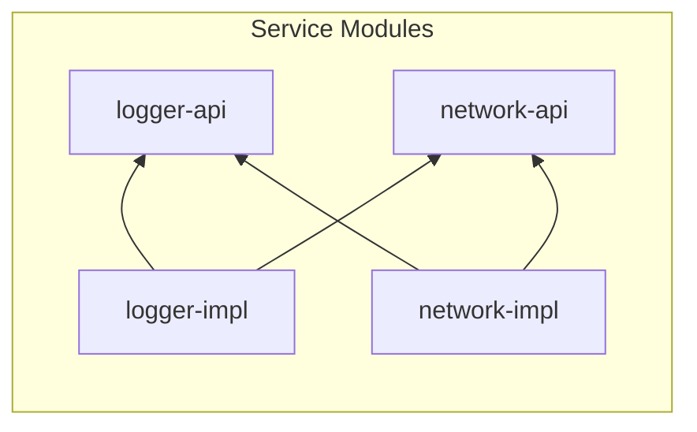
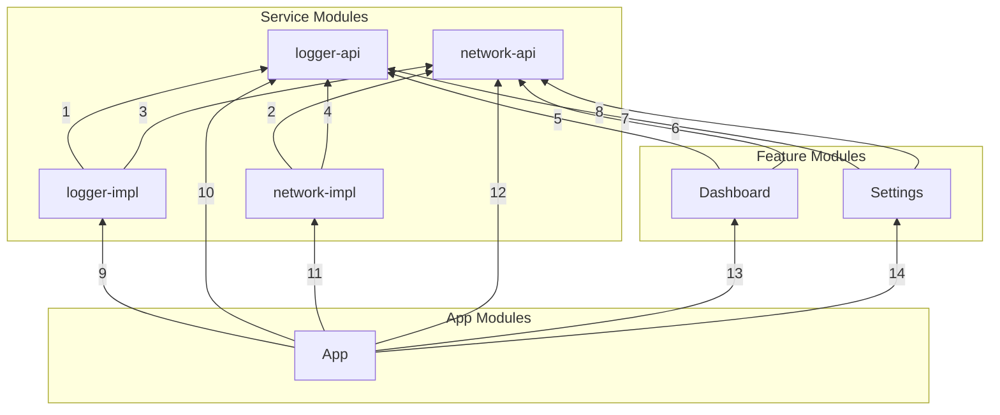
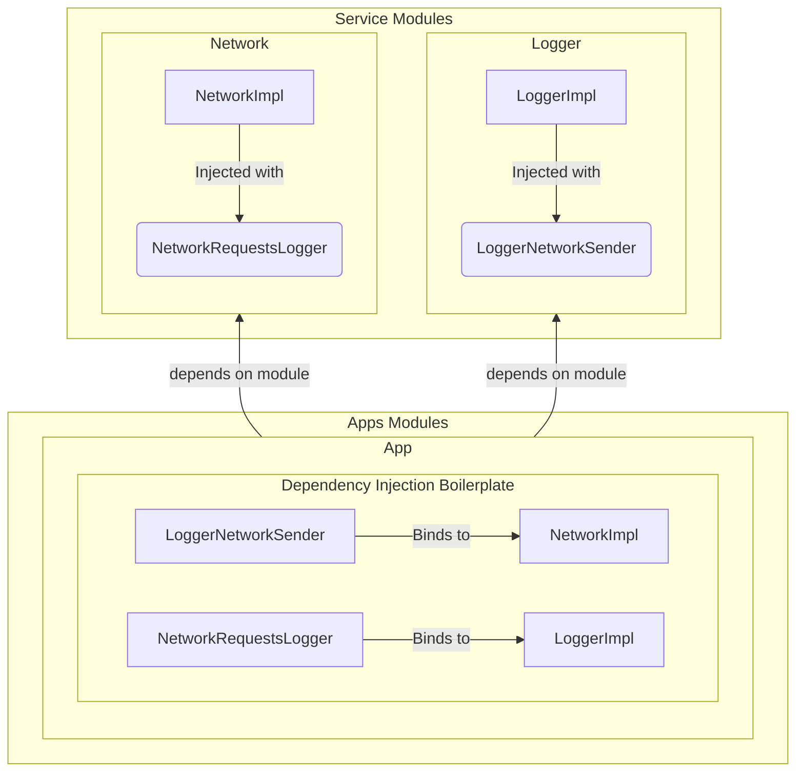
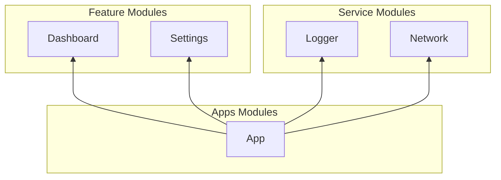

Once a project reaches a certain size, the need to modularize becomes crucial for many reasons but especially to keep the codebase maintainable and scalable.

Let's explore two ways to modularize our codebase: **API/IMPL** and **API/DI**.

## Use Case

Let's look at a use case of two Services that need each other, a `Logger` service that needs to send logs over the network and an `Network` service that needs to log its requests.


We're clearly in a circular dependency here, so we need to break it.

> ℹ️ Circular dependency is not the only reason to modularize, as there are many others. Reducing incremental build-time is a big one, but also to enforce separation of concerns, to make the codebase more maintainable, and to make it easier to test.

## API / IMPL

Also called "interface modules" or "APIs on Implementations", those interfaces are the public API of a service to all the rest of the codebase, so every module that needs that service will depend on the API module of said service.

Every Service is split into two modules:

- the **API** module, containing the interface of the service
- the **IMPL** module, containing the implementation of the service

We'll be able to break the circular dependency by creating a `Logger` API and a `Network` API, and then have the `Logger` IMPL depend on the `Network` API, and the `Network` IMPL depend on the `Logger` API.



In terms of code of the `Logger` service for example, the API module `logger-api` will contain the following interface:

```kotlin
interface Logger {
    fun log(message: String)
}
```
And the Logger implementation module `logger-impl` will contain the following class:

```kotlin
class LoggerImpl @Inject constructor(
    private val network: Network,
): Logger {
    override fun log(message: String){
        // log the message and send to the network through the network service
    }
}
```

It looks fine, but let's look at the whole picture with an `app` module and two features, a `dashboard` feature, and a `settings` feature that depend on the `Logger` and `Network` API services:



Here's an explanation for each dependency:

1. The `Logger` IMPL depends on the `Logger` API, as it implements it
2. The `Network` IMPL depends on the `Network` API, as it implements it
3. The `Logger` IMPL depends on the `Network` API, as it sends logs over the network
4. The `Network` IMPL depends on the `Logger` API, as it logs network requests
5. The `Dashboard` feature depends on the `Logger` API, as it logs
6. The `Dashboard` feature depends on the `Network` API, as it sends network requests
7. The `Settings` feature depends on the `Logger` API, as it logs
8. The `Settings` feature depends on the `Network` API, as it sends network requests
9. The `App` depends on the `Logger` IMPL, as it needs to provide its implementation to other modules
10. The `App` depends on the `Logger` API, as it needs it to compile
11. The `App` depends on the `Network` IMPL, as it needs to provide its implementation to other modules
12. The `App` depends on the `Network` API, as it needs it to compile
13. The `App` depends on the `Dashboard` feature, as it needs to provide to present the feature to the user
14. The `App` depends on the `Settings` feature, as it needs to provide to present the feature to the user


This already looks quite messy, and we only have two services and two features. 

Imagine having a dozen services and a dozen features, or more! 😱


> ℹ️ It is true that thanks to the Gradle/AGP `api()` function for dependencies we could remove the 10th and 12th dependencies, as the `Logger` and `Network` API modules will be brought to the app through their implementations but this doesn't simplify much the graph, and I'd agree that it actually hides some part of the complexity.

## API / DI

APIs on DI (Dependency Injection) means that instead of having a public API that every module can depend on, each module will declare for itself what are its own needs as interfaces and the `app` module will provide the implementations, making the bridge between those needs and the implementations.

If we look at the circular dependency problem with the `Logger` and `Network` services, we would solve it through API/DI like this:



What is going on here?

The `LoggerImpl` class is injected with a `LoggerNetworkSender` interface (placed in its own module) **without any dependency** on the `Network` module.

The `NetworkImpl` class is injected with a `NetworkRequestsLogger` interface (placed in its own module) **without any dependency** on the `Logger` module.

The `app` module is responsible for providing the implementations of those interfaces to the `Logger` and `Network` modules and does it through Dependency Injection by binding the `LoggerNetworkSender` to the `NetworkImpl` and the `NetworkRequestsLogger` to the `LoggerImpl`.

Let's look at the whole dependency graph in **terms of modules** only, with the `Dashboard` and `Settings` features:



Every module becomes **completely independent and isolated from the others**, at the price of defining an interface for every dependency, which was not needed in the API/IMPL approach, so API/DI could result in a considerable amount of boilerplate code.

The main advantage here is that **on every change in every module, only the module itself and the `app` module will be recompiled!** 🚀

Also, since each module defines its own dependencies to other modules via interfaces only, those interfaces will contain functions and properties that are actually used by the module, and nothing else, which means no unintended knowledge/access sharing and no need to mock functions and properties that are never used by the module in tests, which enforces **Interface Segregation Principle**, the **I** in [**SOLID**](https://en.wikipedia.org/wiki/SOLID).

Imagine a Feature Flag Module where in API/IMPL all feature flags are accessible in one interface to all. This can cause issues if a developer uses the wrong feature flag (we're all humans!). 
In API/DI, the Feature Flag Module will not be accessible from every module, only from the `app` module, which will provide the right feature flag to the right module.

> ℹ️ Thanks to [Srđan Stanić](https://www.linkedin.com/in/srdanstanic/) for [mentioning](https://www.linkedin.com/feed/update/urn:li:activity:7202197393843326976?commentUrn=urn%3Ali%3Acomment%3A%28activity%3A7202197393843326976%2C7202210336525979648%29&dashCommentUrn=urn%3Ali%3Afsd_comment%3A%287202210336525979648%2Curn%3Ali%3Aactivity%3A7202197393843326976%29) the **Interface Segregation Principle**!

## Conclusion

Both approaches are valid and have their pros and cons.
The **API/IMPL** approach is more straightforward and easier to understand, but it quickly becomes a mess when the number of modules grows.
The **API/DI** approach creates boilerplate code but scale much better and reduces meaningfully the incremental build-time.

Personally after using for two years the API/IMPL approach, I'm now leaning towards the API/DI approach, as I find it much better for **reducing incremental build-time** and making **testing** much easier.

What do you think of those two approaches? Do you have a preference? 

Let me know on in the comments!

Cheers! 🥂
