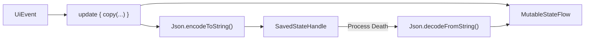

We already know that [Process Death is the rule, not the exception](/posts/process-death-is-the-rule-not-the-exception), and we've seen [how to solve those issues with State Management](/posts/how-to-solve-process-death-issues).

In a ViewModel, the tool for the job is `SavedStateHandle`. But the way we're usually taught to use it doesn't scale past two or three fields, and I'd like to show you an alternative that scales to any screen, for free.

## What we're building

Let's take a small, boring screen: a recipe draft. The user types a title, adds ingredients one by one, and walks through a two-step wizard.

```kotlin
data class Ingredient(
    val name: String,
    val grams: Int,
)

data class RecipeUiState(
    val title: String = "",
    val ingredients: List<Ingredient> = emptyList(),
    val step: Int = 0,
    val isLoading: Boolean = false,
)
```

Nothing here comes from the server. If the user typed it and we lose it, they typed it for nothing.

## What is usual

The usual approach is to treat `SavedStateHandle` as a `Map<String, Any?>` and save field by field:

```kotlin
class RecipeViewModel(
    private val savedStateHandle: SavedStateHandle,
) : ViewModel() {

    private val _uiState = MutableStateFlow(
        RecipeUiState(
            title = savedStateHandle["title"] ?: "",
            step = savedStateHandle["step"] ?: 0,
        )
    )
    val uiState: StateFlow<RecipeUiState> = _uiState.asStateFlow()

    fun onTitleChanged(title: String) {
        savedStateHandle["title"] = title
        _uiState.update { it.copy(title = title) }
    }

    fun onStepChanged(step: Int) {
        savedStateHandle["step"] = step
        _uiState.update { it.copy(step = step) }
    }

    fun onIngredientAdded(ingredient: Ingredient) {
        val ingredients = _uiState.value.ingredients + ingredient
        savedStateHandle["ingredients"] = ArrayList(ingredients) // ⚠️ compiles, crashes later
        _uiState.update { it.copy(ingredients = ingredients) }
    }
}
```

This is what most codebases do, and it mostly works. It has three problems:

- **Every field is written twice**, once into the `StateFlow` and once into the handle. The day someone adds a field and forgets the second line, the bug is invisible until a user comes back from the background.
- **The string keys are untyped**. `savedStateHandle["step"]` returning `null` because someone renamed a key is a compile-time non-event and a runtime `0`.
- **`List<Ingredient>` doesn't fit** — and nothing tells us so. This one deserves its own section.

### The ingredients line is a trap

A `Bundle` only takes a fixed set of types, so `Ingredient` has to become `Parcelable`. Fine. The
problem is *when we find out that we forgot*.

We might expect that `savedStateHandle["ingredients"] = ArrayList(ingredients)` fails to compile.
It doesn't. `SavedStateHandle`'s accessors are declared with a completely **unbounded** generic:

```kotlin
@MainThread public operator fun <T> get(key: String): T?
@MainThread public operator fun <T> set(key: String, value: T?)
```

No `T : Parcelable`, no `T : Serializable`. Any type at all satisfies that signature, so the
compiler waves our `Ingredient` straight through.

Surely `set()` catches it at runtime, then? It does validate — but look at what it validates
against ([`isAcceptableType`](https://cs.android.com/androidx/platform/frameworks/support/+/androidx-main:lifecycle/lifecycle-viewmodel-savedstate/src/androidMain/kotlin/androidx/lifecycle/internal/SavedStateHandleImpl.android.kt)):

```kotlin
internal actual fun isAcceptableType(value: Any?): Boolean =
    value == null || ACCEPTABLE_CLASSES.any { classRef -> classRef.isInstance(value) }
```

And in that `ACCEPTABLE_CLASSES` list, with a comment that says everything:

```kotlin
// type erasure ¯\_(ツ)_/¯, we won't eagerly check elements contents
ArrayList::class.java,
```

`ArrayList` **is** an acceptable class, and by design nothing looks *inside* it. So our line
compiles, passes validation, and the `set()` returns happily. The failure only comes later, when
the `Bundle` is really written out to a `Parcel`:

```
java.lang.IllegalArgumentException: Can't put value with type class java.util.ArrayList into saved state
```

> ⚠️ Read that sequence again, because it's the whole point: the mistake is invisible at compile
> time, invisible at `set()` time, and surfaces **at process-save time — on a device, in front of
> a user**. It is the single worst moment for a bug to introduce itself.

And that's before we get to the fact that making `Ingredient` `Parcelable` puts an Android-only
annotation on a domain model — which simply isn't an option if that model lives in a Kotlin
Multiplatform module.

We're also saving things we shouldn't. `isLoading = true` restored after process death gives the user a spinner that will never stop, because the coroutine that was going to flip it back died with the process.

## The alternative: save the whole state, once

Here's the idea: our `UiState` is already the single source of truth for the screen. Instead of picking it apart into keys, we **serialize the whole thing into one String** and put that String in the handle.

`SavedStateHandle` is perfectly happy holding a `String`, and a `String` is perfectly happy holding a whole object graph.

### Step 1: annotate the state

```kotlin
@Serializable
data class Ingredient(
    val name: String,
    val grams: Int,
)

@Serializable
data class RecipeUiState(
    val title: String = "",
    val ingredients: List<Ingredient> = emptyList(),
    val step: Int = 0,
    @Transient val isLoading: Boolean = false,
)
```

That's it for the model. Two annotations, and the nested `List<Ingredient>` comes along for the ride at no extra cost.

> ℹ️ `@Transient` is how we say "this field is **not** worth restoring". Loading flags, one-time actions, anything that a coroutine owns and will recompute anyway. Note that `@Transient` fields **must** have a default value, which is exactly the behaviour we want: they come back as `false`, not as they were.

### Step 2: save and restore in the ViewModel

```kotlin
private const val KEY_STATE = "ui_state"

class RecipeViewModel(
    private val savedStateHandle: SavedStateHandle,
) : ViewModel() {

    private val _uiState = MutableStateFlow(restoreState() ?: RecipeUiState())
    val uiState: StateFlow<RecipeUiState> = _uiState.asStateFlow()

    private fun update(block: RecipeUiState.() -> RecipeUiState) {
        val newState = _uiState.updateAndGet { it.block() }
        savedStateHandle[KEY_STATE] = Json.encodeToString(newState)
    }

    private fun restoreState(): RecipeUiState? =
        savedStateHandle.get<String>(KEY_STATE)?.let { Json.decodeFromString(it) }

    fun onTitleChanged(title: String) = update { copy(title = title) }

    fun onIngredientAdded(ingredient: Ingredient) = update {
        copy(ingredients = ingredients + ingredient)
    }

    fun onStepChanged(step: Int) = update { copy(step = step) }
}
```

Look at what happened to the bottom half of that class. Every event handler is a one-liner, and **not a single one of them mentions saving**. The `update()` function is the only place that touches `SavedStateHandle`, so a new field can never be forgotten — it was already inside the state we just serialized.



If you're writing an MVI base class, `update()` is exactly where this belongs — write it once in `MVIViewModel`, and every screen in the app becomes process-death-proof by inheriting it.

> ⚠️ Serializing on every keystroke is cheap (it's a small object), but it isn't free. If a screen holds a genuinely large state, serialize in `onCleared()` and on a debounce instead of on every update.

### Not using kotlinx.serialization?

The pattern is the pattern — only the two `Json` calls change. With Gson:

```kotlin
private val gson = Gson()

private fun save(state: RecipeUiState) {
    savedStateHandle[KEY_STATE] = gson.toJson(state)
}

private fun restoreState(): RecipeUiState? =
    savedStateHandle.get<String>(KEY_STATE)?.let { gson.fromJson(it, RecipeUiState::class.java) }
```

No `@Serializable` needed, and the equivalent of `@Transient` is Kotlin's `@Transient` (`kotlin.jvm.Transient`), which maps to the Java `transient` keyword that Gson skips. Moshi works the same way with `@JsonClass(generateAdapter = true)`.

The only real difference is that `kotlinx.serialization` does its work at compile time, so it will tell you *at build time* that a field of yours isn't serializable, while Gson will find out at runtime, in front of a user. That, and it's the one that works in a Kotlin Multiplatform module.

## How do we actually test this?

This is the part that usually gets skipped, and it's the part that matters. A state restoration that was never tested is a state restoration that doesn't work.

The good news: we no longer need an emulator, `adb shell am kill`, or a "Don't keep activities" toggle to test this. Since `androidx.lifecycle:lifecycle-viewmodel-testing` there's a `viewModelScenario` with a **`recreate()`** function that does exactly what the system does — it takes the current `SavedStateHandle` contents, throws the ViewModel away, and builds a new one from that saved state.

```kotlin
testImplementation("androidx.lifecycle:lifecycle-viewmodel-testing:$lifecycleVersion")
```

And the test:

```kotlin
@Test
fun `recipe draft survives process death`() {
    viewModelScenario { RecipeViewModel(createSavedStateHandle()) }.use { scenario ->
        scenario.viewModel.apply {
            onTitleChanged("Pancakes")
            onIngredientAdded(Ingredient(name = "Flour", grams = 250))
            onStepChanged(1)
        }

        scenario.recreate() // 💀 process death happens here

        val restored = scenario.viewModel.uiState.value
        assertEquals("Pancakes", restored.title)
        assertEquals(listOf(Ingredient(name = "Flour", grams = 250)), restored.ingredients)
        assertEquals(1, restored.step)
    }
}
```

`scenario.viewModel` after `recreate()` is a **different instance**. Everything that comes back came back through the `SavedStateHandle`, which means this test fails the moment someone breaks the save path.

And the other half of the test, the one that's just as important:

```kotlin
@Test
fun `transient state does not survive process death`() {
    viewModelScenario { RecipeViewModel(createSavedStateHandle()) }.use { scenario ->
        scenario.viewModel.onSaveClicked() // sets isLoading = true

        scenario.recreate()

        assertFalse(scenario.viewModel.uiState.value.isLoading)
    }
}
```

That's the test that pins down `@Transient` and stops a future refactor from restoring a user into an eternal spinner.

> ℹ️ These are plain JVM unit tests. They run in milliseconds, on CI, on every pull request — which is the only way process-death coverage stays alive over time. Compare that to [detecting these issues with Appium](/posts/how-to-detect-process-death-issues-with-appium) or [with Maestro](/posts/how-to-detect-process-death-issues-with-maestro): those E2E tests are still worth having for the full-app flows, but they're far too slow to be your first line of defence.

## Conclusion

Two annotations on the state, one `update()` function, one `recreate()` test:

- **`@Serializable` on the `UiState`** — nested lists and objects included, for free
- **`@Transient` on anything a coroutine owns** — loading flags, one-time actions
- **One place that writes to `SavedStateHandle`** — so no field can ever be forgotten
- **`viewModelScenario { }.recreate()`** — process death as a fast JVM unit test

The reason I like this so much is that it removes the discipline requirement. The usual approach works fine *as long as every developer remembers, on every field, forever*. This one works because there's nothing to remember.

Let me know what you think or if you have questions in the comments! 📝

By the way, I'm also on [Twitter](https://twitter.com/galex) and [LinkedIn](https://www.linkedin.com/in/agherschon/), so feel free to connect there too!

Stay tuned for more posts on Android Development! 🚀
