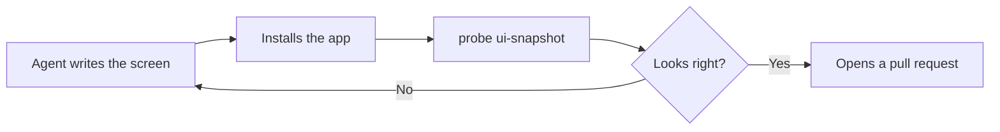

Our agent writes Compose code, the build goes green, and it tells us the feature is done. Then we
install the app, we look at it, we describe what's wrong in words, the agent fixes it, and around we
go again. The agent is fast at every step except the one that decides whether the work is any good,
and that step goes through **us**. 😅

So how do we let our agent look at the app by itself?

> ℹ️ This post was written with the help of a coding agent, and edited by me. It would be quite
> absurd to write about working with an agent and pretend otherwise! The setup below is one I built
> and use every day, and the mistakes in it are mine.

## The Problem

We need a way to let our agent see a screen the way a user sees it, navigate through it, press
buttons, take screenshots, and so on, and none of that exists today from official sources (wink wink
Google?).

### Maestro and its MCP server

My first reflex was to give my agent that visibility through [Maestro](https://maestro.mobile.dev/)
and its MCP server, and Maestro is genuinely good at what it's built for, which is **replaying a
whole scripted journey** and telling us at the end whether it passed. That's not the question our
agent keeps asking. Its question is "**what is on this screen, right now?**", and it asks it after
every single edit. Answering that with Maestro costs a YAML file, a run, and a round trip through a
shell, which is an enormous amount of ceremony for one glance.

Maestro also goes **around** our app, through `adb`, so what comes back is a **copy** of the UI
tree, flattened through the accessibility bridge on the way out. Ids get merged into their nearest
clickable ancestor, and our agent ends up reasoning about a lossy summary of a screen it still
cannot see.

> ⚠️ One more thing to know before reaching for it: the MCP server caches a single device session
> and keeps handing that same one back, so as soon as another Maestro process restarts the on-device
> driver, which is exactly what happens when we also open their amazing desktop app, every call
> after the first one fails until we reconnect the server by hand. I reported it as
> [issue #2839](https://github.com/mobile-dev-inc/Maestro/issues/2839) and opened a fix for it, and
> both are still open today.

### Android CLI and Compose previews

To be fair, this got much better recently. [Android CLI](https://developer.android.com/tools/agents/android-cli)
went stable at Google I/O 2026 and it ships an agent skill that finally gives our agent something to
look at:

```bash
android render-compose-preview
```

That renders one of our `@Preview` composables to a PNG **on the host**, with no device and no
emulator involved, and it can also print the semantics tree of what it rendered as JSON, so our
agent gets the ids and the structure and not only the pixels. It writes a composable, renders its
preview, and looks at the result. That is a real step forward, and we should absolutely use it! 🚀

It's just nowhere near enough, because **a preview is not our app**:

- It renders a `@Preview` function **somebody wrote by hand**, with sample data. The real screen
  gets its state from a ViewModel, and none of that is in the picture.
- It renders **one composable, in isolation**. The loading, empty and error states exist only if
  somebody also wrote a preview for each of them.
- There is **no navigation**. Our agent can't reach a screen by tapping its way there, because
  there is no app running to tap through.
- There is **no interaction at all**. It's a still frame, so nothing can be tapped, typed into or
  scrolled, and nothing that only breaks on the second tap will ever show up.

A preview tells us that a composable **renders**. It cannot tell us that the feature **works**.

## The Solution

The tree Maestro reads through the accessibility bridge comes from **Compose's own semantics tree**,
the one it already keeps in memory to lay out our screens and to run our UI tests. Everything our
agent needs is therefore already **inside our app**, and every tool we use reads a degraded copy of
it from the outside!

So let's read the real one from inside, through an **HTTP server embedded in the debug build**, with
a small CLI on top of it. The server does the work, and the CLI is what our agent actually types:



That loop is the whole goal. Our agent runs it on its own, and we step back in at the end, to review
a pull request that already works! 🚀

### The demo project

I've built the smallest possible app that proves it works, and it's on GitHub as
[toy-app](https://github.com/galex/toy-app). Two Compose screens, a list of toys and a toy detail,
because every technique here has to be visible in one screenshot.

```
app/              two Compose screens and a six-item list of toys
automation-ids/   Modifier.automationId, so every element has a stable, unique id
probe-server/     a debug-only HTTP server inside the app, reading Compose's semantics tree
probe/scripts/    the CLI our agent drives, and the YAML flow runner (standard-library Python 3)
probe/flows/      one flow: open the list, open a toy, come back
```

The ids come from `Modifier.automationId`, which is exactly the `AutomationContext` we built in
[How to provide View IDs in Compose](/posts/how-to-provide-view-ids-in-compose), so a row in a list
gets `toys_index_2_card` and can never be confused with its nineteen siblings.

### Keeping it out of release builds

This is a **remote control server for our own app**, so it must never be reachable in a release
build. Rather than remembering to check a flag, let's make it structural and let Gradle do the work:

```kotlin
// app/build.gradle.kts
dependencies {
    implementation(projects.automationIds)

    // The probe is a DEBUG-ONLY dependency. Not "guarded by a flag": in a release build there is no
    // probe code in the APK at all, which is why ProbeStarter has a no-op twin in src/release.
    debugImplementation(projects.probeServer)
}
```

Then we split the code that starts it across source sets, with `src/debug` holding the real call:

```kotlin
// app/src/debug/kotlin/dev/galex/toyapp/ProbeStarter.kt
fun Application.startProbeIfDebug() {
    startProbe(
        application = this,
        config = ProbeConfig(
            appName = "Toy App",
            versionName = BuildConfig.VERSION_NAME,
            packageName = BuildConfig.APPLICATION_ID,
            port = 4242,
        ),
        hooks = ProbeHooks(breadcrumb = { NavBridge.breadcrumb }),
    )
}
```

and `src/release` holding a twin that does nothing at all:

```kotlin
// app/src/release/kotlin/dev/galex/toyapp/ProbeStarter.kt
@Suppress("UnusedReceiverParameter")
fun Application.startProbeIfDebug() = Unit
```

There is nothing to strip and nothing to forget, because the probe module is **not on the release
compile classpath**. The Application class calls the same function name in both variants.

### A recorded flow

Now the good part. Everything our agent verified by hand during a session is **gone the moment the
session ends**, unless we write it down. So the CLI has a flow runner, and a flow is a YAML file of
the steps it just performed:

```yaml
name: open a toy
port: 4242
steps:
  # We start on the list.
  - assert_id: toys_title
  - assert_text: "Wooden Train"
  - screenshot: 01-toy-list.png

  # Open the third toy. The id carries its row index, so this can never hit the wrong card.
  - tap_id: toys_index_2_card

  # Assert on the breadcrumb rather than on the copy: a translation would break the copy.
  - assert_breadcrumb: "ToyDetail(building-blocks)"
  - assert_id: toy_detail_name
  - assert_text: "Building Blocks"
  - assert_text: "Construction"
  - screenshot: 02-toy-detail.png

  # And back, which proves the navigation actually popped rather than stacking another screen.
  - tap_id: toy_detail_back_button
  - assert_breadcrumb: "Toys"
  - assert_no_text: "under the sofa"
  - screenshot: 03-back-on-list.png
```

`./demo.sh` in the demo project builds the APK, installs it, launches it, forwards the port and runs
that flow. Here is the last run, pasted raw:

```
flow 'open a toy': 13 step(s) against http://127.0.0.1:4242
  ok   [0] assert_id 'toys_title' ok  (24ms)
  ok   [1] assert_text 'Wooden Train' ok  (10ms)
  ok   [2] screenshot -> probe-artifacts/01-toy-list.png  (139ms)
  ok   [3] tap_id 'toys_index_2_card' -> (640,948)  (59ms)
  ok   [4] assert_breadcrumb 'ToyDetail(building-blocks)' ok (at 'Toys > ToyDetail(building-blocks)')  (12ms)
  ok   [5] assert_id 'toy_detail_name' ok  (7ms)
  ok   [6] assert_text 'Building Blocks' ok  (6ms)
  ok   [7] assert_text 'Construction' ok  (6ms)
  ok   [8] screenshot -> probe-artifacts/02-toy-detail.png  (123ms)
  ok   [9] tap_id 'toy_detail_back_button' -> (262,588)  (11ms)
  ok   [10] assert_breadcrumb 'Toys' ok (at 'Toys')  (8ms)
  ok   [11] assert_no_text 'under the sofa' ok  (8ms)
  ok   [12] screenshot -> probe-artifacts/03-back-on-list.png  (122ms)
flow 'open a toy' passed in 2.4s
```

Thirteen steps, three screenshots, **2.4 seconds**, and nobody looked at anything! 🤩

Here is that same flow driving the app, recorded on an emulator at the speed it really runs. Nobody
touched the screen, every tap in there comes from the flow:



It takes a few seconds longer on video than the 2.4 seconds above, because recording the screen
and driving the app at the same time asks the emulator to do two jobs at once, but that is the whole
flow in one take, from the app opening to the last assertion.

The steps our agent performed to check its own work **are** the regression test, so the session
leaves a suite behind instead of evaporating. And since the runner also writes a JUnit XML file, the
whole thing runs on an emulator in CI and attaches the screenshots to the pull request.

## Conclusion

Letting an agent read and drive the running app changed my daily work more than any model upgrade
did. The agent didn't get smarter, it just stopped being blind, and once it could check itself, I
got to stop being its screenshot service! ❤️

It's still not magic. Anything gesture-heavy is painful to drive this way. Animations caught
mid-flight lie to us. And taste is completely out of reach: our agent can tell us a screen **is**
correct, but it will never tell us it looks **good**. 🤷

The fastest way to get this into our own project is to hand the whole thing to our agent as one
prompt, and here is the short version of the one I use. The full one carries every trap I hit while
building this, each of them cost me an evening, and it lives in the demo project as
[PROMPT.md](https://github.com/galex/toy-app/blob/main/PROMPT.md). Both work on a plain **Android**
project and on a **Kotlin Multiplatform** one, because the first thing they ask is which one we're
in.

Two things about its shape are worth stealing, whatever we're briefing an agent on. **Constraints
come before capabilities**, because a wrong "how" is much more expensive than a missing "what". And
it **stops after the smallest slice**, so the agent has to prove `/app_info` answers before it builds
eleven endpoints on a foundation that doesn't hold.

````markdown
Build me a dev-only "probe" for this app: an HTTP server embedded in the debug build, and a CLI on
top of it, so that you can read and drive the running app yourself instead of asking me to look at
my screen.

## Rules that apply to everything below

- The probe must be IMPOSSIBLE to ship in a release build. Not "guarded by a flag", absent.
- The probe must never crash, freeze or slow down the app it lives in. A dev tool that can take
  down the app it inspects is worse than no dev tool at all.
- Every handler returns JSON. On failure it returns {"ok": false, "error": "..."} with a message
  that tells the caller what to do next. Nothing is allowed to throw out of a handler.
- No new dependency in the app itself beyond Ktor server + kotlinx-serialization in the dev module.
- Work in the order below and STOP where I tell you to stop.

## Phase 0: what kind of project is this?

Read the build files and tell me whether we are on plain Android or on KMP, whether the screens are
Compose or Android Views, and which module owns the Application class. Say which path you are taking
before writing anything.

## Phase 1: the module, and /app_info only

A `probe-server` module wired in with `debugImplementation`, started from a `src/debug` source set
with a no-op twin in `src/release`, holding an embedded Ktor CIO server bound to 127.0.0.1 on one
static port, with GET /app_info returning the config as JSON. STOP HERE: I install a debug build and
curl it before you go any further.

## Phase 2: seeing the screen

GET /ui_snapshot returning every visible element as {id, text, role, x, y, width, height,
clickable}, read from Compose's OWN unmerged semantics tree rather than through accessibility. Plus
GET /backstack returning where we are in the app as a breadcrumb, because assertions on a breadcrumb
survive translation and assertions on visible copy do not.

## Phase 3: driving the screen

One ProbeDriver interface implemented per platform: tap, swipe, inputText, pressBack, screenshot,
displaySize. Routes: POST /tap, /swipe, /input_text, /press_back, and GET /screenshot, /logs, plus
POST /login and /logout wired to app-specific hooks so a run starts from a known state.

## Phase 4: the CLI I actually drive

Under probe/scripts/, standard-library Python 3 ONLY, no pip install and no build step: a client
with one method per endpoint that owns the port map, a `probe` argparse CLI with one subcommand per
endpoint, and a forward.sh for adb. Write every error message for the agent reading it.

## Phase 5: from a session to a suite

A YAML flow runner next to the CLI: assert_id, assert_text, assert_no_text, assert_breadcrumb,
tap_id, input_text, press_back, screenshot, where tap_id resolves an id through /ui_snapshot so a
flow never carries a hard-coded coordinate. Support --screenshot-every-step and --junit-xml.

## Phase 6: keep it switched on

Add the CLI and its rules to CLAUDE.md, so you reach for it without being asked: after any UI
change, install the app and verify with ui-snapshot before saying it is done, and never tap
coordinates you did not just read from a snapshot.

## Definition of done

From a fresh clone: install a debug build, run forward.sh, and drive a full screen end to end with
the CLI alone. `probe ui-snapshot` returns real ids with real bounds, `probe tap` lands on the
element those bounds describe, one YAML flow passes, and no release variant contains a single line
of probe code.
````

Are you letting your agent verify its own UI work, or are you still the one looking at the screen?

Let me know what you think or if you have questions in the comments! 📝

By the way, I'm also on [Twitter](https://twitter.com/galex) and [LinkedIn](https://www.linkedin.com/in/agherschon/), so feel free to connect there too!

Happy automating! 🤖
