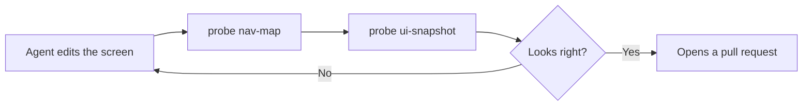

Our agent can finally see the running app, through the probe we built in
[How to Make Our Coding Agent Fully Independent](/posts/how-to-make-your-coding-agent-fully-independent).
It still has **no idea where anything is**. 😅

Watch it work. It wants to check the toy detail screen, so it runs `probe ui-snapshot`, reads every
element of the list screen, decides that a card **looks** tappable, taps it, and dumps the whole
screen again to find out where it landed. Then we change a padding value, and it does all of that a
second time, **from scratch**.

So how do we stop our agent from rediscovering our own app on every single edit?

## The Problem

A snapshot is the right tool for "**what is on this screen right now**", and the wrong tool for
"**where is that screen and how do I get there**". It answers the second question by accident, at
the price of a few hundred lines of JSON per attempt, and its answer only covers the one screen we
happen to be standing on.

Worse, **none of it accumulates**. Everything our agent learned about our navigation graph dies with
the session, so the next one starts blind and pays for the same exploration again.

## The Solution

The navigation graph is not a thing to be **discovered** at runtime, it's a thing we already
**know**. So let's declare it as **Kotlin**, inside the app, and let the probe serve it as JSON on
`GET /nav_map` like every other answer it already gives.

Everything below runs in the demo project, on the
[post/navigation-map](https://github.com/galex/toy-app/tree/post/navigation-map) branch, which stays
there forever so this post keeps having code to point at.

The types go in the probe module, and they are the whole vocabulary:

```kotlin
// probe-server/src/main/kotlin/dev/galex/toyapp/probe/NavigationMap.kt
data class NavigationMap(val screens: List<Screen>)

data class Screen(
    val id: String,
    val breadcrumb: String,     // what the app reports once we are here
    val entry: Boolean = false, // true for the screen the app opens on
    val ids: List<String>,      // every automation id this screen owns
    val actions: List<Action> = emptyList(),
)

data class Action(
    val tapId: String,
    val leadsTo: String,        // the id of the Screen this tap lands on
)
```

### Declaring it next to the screens

The map itself is one static object in the app's `src/debug` source set, so it never reaches a
release build, and it names its elements with the **same constants the screens pass to**
`Modifier.automationId`, the `AutomationContext` from
[How to provide View IDs in Compose](/posts/how-to-provide-view-ids-in-compose):

```kotlin
// app/src/debug/kotlin/dev/galex/toyapp/AppNavigationMap.kt
val AppNavigationMap = NavigationMap(
    screens = listOf(
        Screen(
            id = "toys",
            breadcrumb = "Toys",
            entry = true,
            ids = listOf(ToysIds.Title, ToysIds.List, ToysIds.card(INDEX)),
            actions = listOf(Action(tapId = ToysIds.card(INDEX), leadsTo = "toy_detail")),
        ),
        Screen(
            id = "toy_detail",
            // The toy id is data, so it stays a placeholder: we check the shape, not the toy.
            breadcrumb = "ToyDetail({toyId})",
            ids = listOf(
                ToyDetailIds.Name,
                ToyDetailIds.Meta,
                ToyDetailIds.Description,
                ToyDetailIds.BackButton,
            ),
            actions = listOf(Action(tapId = ToyDetailIds.BackButton, leadsTo = "toys")),
        ),
    ),
)

/** One entry describes all six rows of the list, so the index is left to be filled in. */
private const val INDEX = "{index}"
```

and the probe reaches it through one more hook, right next to the breadcrumb one we already had:

```kotlin
hooks = ProbeHooks(
    breadcrumb = { NavBridge.breadcrumb },
    navigationMap = { AppNavigationMap },
),
```

`probe nav-map` prints it, and here is the real answer from the running app, with the second screen
left out for space:

```json
{
  "screens": [
    {
      "id": "toys",
      "breadcrumb": "Toys",
      "entry": true,
      "ids": ["toys_title", "toys_list", "toys_index_{index}_card"],
      "actions": [{ "tapId": "toys_index_{index}_card", "leadsTo": "toy_detail" }]
    }
  ]
}
```

That is the whole thing: a few dozen lines of screen descriptions, once, instead of a UI dump per
question. Our agent's loop loses an entire phase, because the exploring is gone and only the
checking is left:



One rule comes with it, and it's the only maintenance the map ever asks for: **when the navigation
changes, that object changes with it**. A new screen gets its own `Screen`, a new way out of a
screen gets its own `Action`, and both land in the same commit as the code they describe.

### Teaching the agent to read it first

None of this helps if our agent doesn't reach for the map on its own, and the honest answer is that
it won't, unless we tell it. The probe post put those instructions in `CLAUDE.md`, and that works,
but `CLAUDE.md` is loaded on **every single turn**, including the many that never touch the UI at
all.

A **skill** is the better home, because it carries a description the agent matches against what it's
about to do, and it costs nothing until then. Here is the whole thing, at
`.claude/skills/app-navigation/SKILL.md` in the project:

```markdown
---
name: app-navigation
description: Reach a screen in the running app. Use before any tap, screenshot or UI check, to find
  which screen owns an element and how to get there.
---

# Navigating the app

`probe/scripts/probe nav-map` returns every screen of the app, its breadcrumb, the automation ids it
owns and the taps that lead out of it. Ask for it BEFORE anything else.

1. Find in the map the screen that owns the element you care about. Never go looking for it by
   dumping the UI.
2. Tap your way there along the actions the map declares, checking the breadcrumb at each step.
3. Only then `probe/scripts/probe ui-snapshot`, and only to check what you just changed.

## Rules

- Never tap a coordinate that did not come from a snapshot taken seconds ago.
- When you change the navigation, update `AppNavigationMap` in the same edit. A new screen gets a
  `Screen`, a new way out of a screen gets an `Action`, a screen you removed leaves the map.
- A screen you just added is not done until it has a `Screen` in `AppNavigationMap`, with its ids
  and its exits, and its ids come from the `*Ids` object next to the composable.
```

## Conclusion

The map costs one Kotlin object and one endpoint, and it removes the most expensive habit our agent
had, which was **re-reading our app to remember its shape**. This is hard to measure but I feel the
agent is much faster at doing its job now that it has a navigation map at hand, which should also
reduce the **tokens** it used to require to dump the UI as json and analyse it each time it needed
to.

A big thank you to [Dor Ditchi](https://www.linkedin.com/in/dor-ditchi-77a150101/), who came up with
the idea of a navigation map in the first place! ❤️

Let me know what you think or if you have questions in the comments! 📝

By the way, I'm also on [Twitter](https://twitter.com/galex) and [LinkedIn](https://www.linkedin.com/in/agherschon/), so feel free to connect there too!

Happy navigating! 🗺️
